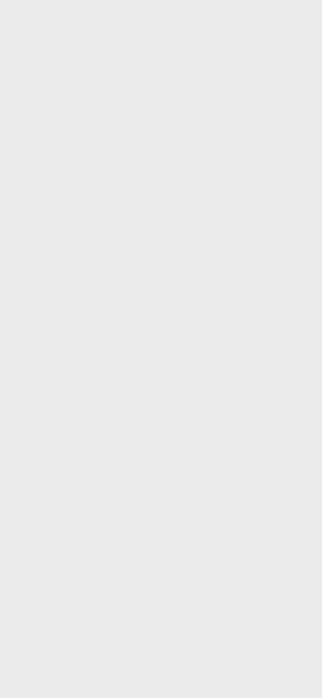
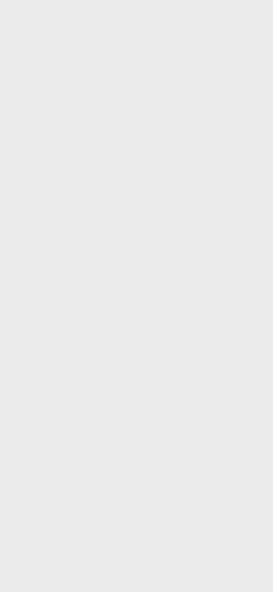
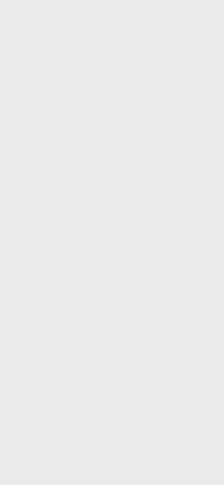
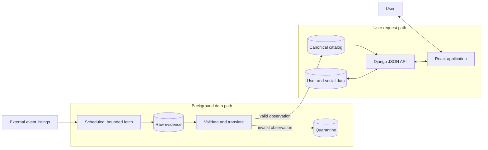
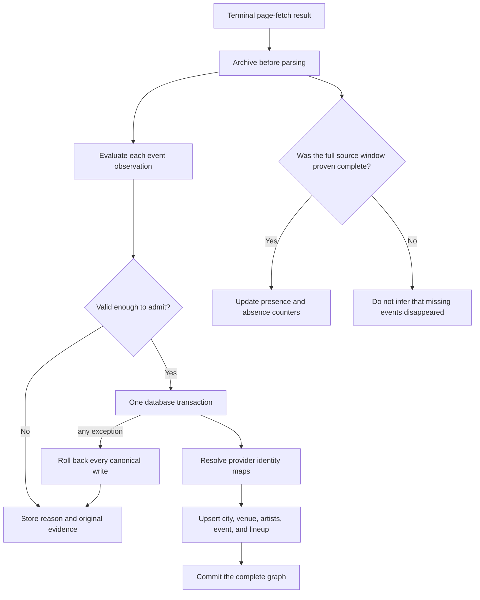
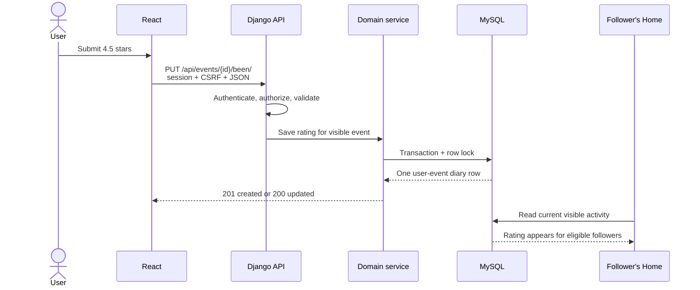
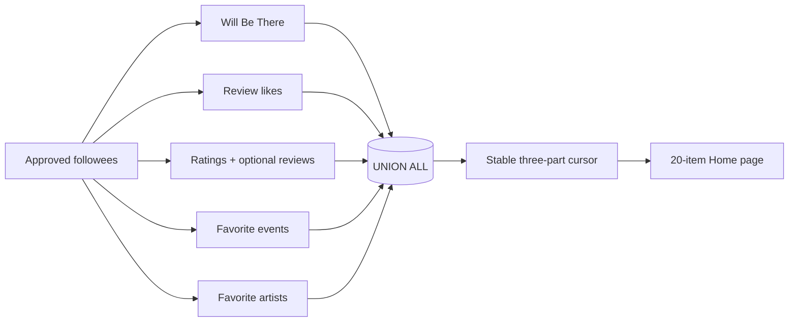
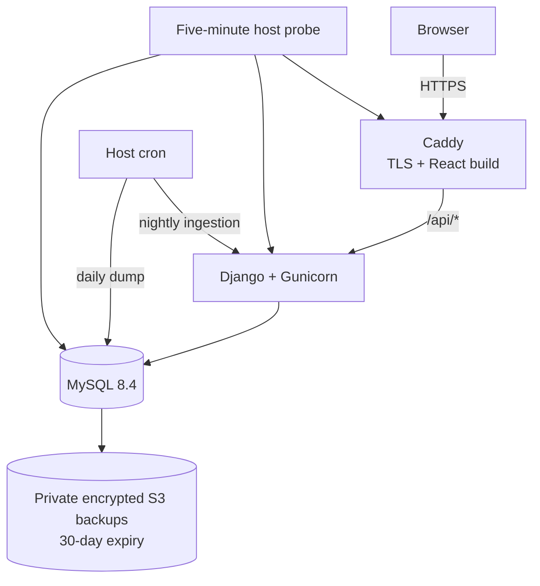

  

<h1 align="center">Onda</h1>

  A social diary for live music: discover events, remember what you attended, and follow the taste of people you trust.

  <a href="DEMO.md"><strong>Demo</strong></a> ·
  <a href="#how-it-works"><strong>How it works</strong></a> ·
  <a href="docs/README.md"><strong>Documentation</strong></a>

## Screens

<table>
  <tr>
    <td align="center" width="20%">
      
       <b>Home</b>
       See what your friends are up to
    </td>
    <td align="center" width="20%">
      
       <b>Discover</b>
       Find events in your city
    </td>
    <td align="center" width="20%">
      
       <b>Event</b>
       Hear it from people who were there
    </td>
    <td align="center" width="20%">
      
       <b>Profile</b>
       Who you are, based on what you do
    </td>
    <td align="center" width="20%">
      
       <b>Favourites</b>
       Let your taste speak
    </td>
  </tr>
</table>

Onda lets people browse live-music events in New York City and Boston, mark plans, log attendance with half-star ratings, publish reviews, follow public or private profiles, and save favorite events, artists, and venues.

The interface is the visible product. The harder engineering problem is underneath it: live music does not have one complete, trusted catalog that Onda can treat as permanent truth. Listings change, disappear, arrive malformed, and use identities owned by an external provider. Onda has to turn those observations into stable product data without allowing a bad response to corrupt the catalog or erase a user's history.

## How it works

### Start with the whole system

There are two deliberately separate paths:

- A **scheduled background path** acquires external listings and decides what Onda can safely trust.
- A **user request path** reads Onda-owned catalog and social data from MySQL. Search, profiles, event pages, and Home never wait for the external provider.

The application is a **modular monolith**: one Django deployment owns ingestion, catalog, accounts, privacy, and the API; React is the browser client; MySQL is the transactional boundary. The source is remote and unreliable, but Onda is not presented as a distributed microservice system.

### 1. Turn uncertain listings into stable catalog data

The technical terms describe concrete behavior:

| Term | What Onda actually does |
|---|---|
| **Raw evidence** | Stores each bounded terminal fetch result before payload parsing, including malformed bodies and transport failures. Oversized responses are refused and recorded as run failures. “What arrived” remains separate from “what Onda concluded.” |
| **Validation and quarantine** | Evaluates each event independently. A malformed event is rejected with a reason while valid siblings from the same page continue. Onda does not invent missing artists, repair dates, or admit a partial event graph. |
| **Per-observation transaction** | The venue, artists, event, identity mappings, and ordered lineup commit together—or all roll back. A failure cannot leave half an event in the catalog. |
| **Idempotency** | Replaying the same provider identity updates the same canonical row instead of creating a duplicate. Rejection records are also uniquely keyed so recovery does not duplicate them. |
| **Identity mapping** | Provider IDs end in four mapping tables for cities, venues, artists, and events. Product and social tables reference stable Onda IDs, never Resident Advisor IDs. This translation boundary is the system's anti-corruption layer. |
| **Completeness-gated reconciliation** | Onda treats absence as evidence only after every expected page and observation was accounted for. An incomplete fetch may add valid data, but it may never hide existing data. |

An event omitted from one complete nightly snapshot becomes `unverified`; after three consecutive complete misses it becomes `hidden`. It is not deleted. Ratings, reviews, likes, plans, and favorites remain attached to the canonical event and reappear if a later valid observation restores it.

The adapter is replaceable by design, but Onda is not source-independent today. Version 1 has one implemented provider. Adding another requires a bounded client, source-to-canonical mapping, real entity-resolution decisions, completeness rules, fixtures, and tests—it is not a configuration switch.

[Read the full ingestion design →](docs/INGESTION.md)

### 2. Put user actions behind one transactional API

Onda uses a first-party, same-origin JSON API. React sends the session cookie on each request; Django resolves authentication and requires its CSRF cookie/header pair for unsafe methods. Views validate HTTP input, domain services own state transitions, and MySQL constraints enforce the invariants that must survive every code path.

One rating illustrates the boundary:

This path distinguishes malformed input from valid requests that violate product rules. For example, a badly shaped rating receives `400`; an authenticated attempt to log an event before its venue-local start receives `409 Conflict`. A review requires a rating, one user can have only one diary entry per event, and half-star values are enforced in both service logic and database checks.

The API is intentionally described as a **first-party application boundary**, not a public developer platform: there are no API keys, OAuth scopes, OpenAPI compatibility promises, or third-party service-level guarantees.

[Review the API contract →](docs/API.md)

### 3. Build the social layer from current truth

Onda does not copy each action into a fan-out feed table. Home is assembled when it is requested from five existing sources:

Each branch produces the same shape and applies profile privacy and event visibility **before** the union and pagination. That ordering matters: filtering afterward could reveal that a private row existed, produce short pages, or make cursors inconsistent.

The cursor uses `(activity time, activity type, source key)`, not time alone, so simultaneous actions still have a total, repeatable order. Because Home reads the source rows directly, an unlike, unfollow, privacy change, or hidden event is reflected on the next request without repairing copied feed records or sending writes to every follower.

The tradeoff is a more complex read. The committed benchmark records the preceding six-branch implementation with 100,000 source rows; it measured 45.908 ms p95 for page 1 and 31.618 ms p95 for page 50 over 200 in-process requests after warm-up. The current five-branch projection retains the four-query regression contract, but that historical timing baseline has not been rerun. It is not a production traffic or capacity claim.

Time-sensitive behavior is evaluated in the event venue's IANA timezone. Whether an event is upcoming, whether it can be added to Been, and whether “Will Be There” is still active cannot change merely because the server or viewer is in another timezone.

[Follow canonical data through the social layer →](docs/APPLICATION_DATA.md)

### 4. Operate one system deliberately

The current engineering demo runs on one AWS EC2 `t4g.small` using Docker Compose. Caddy is the only public container; Django and MySQL remain on the private Compose network. Container health checks, bounded logs, process-level locks, deployment-time backups, and post-deploy health checks keep the operational model proportional to the application's actual scale.

> **Verified August 20, 2026:** the public site and API were live over valid HTTPS; Caddy, Django, and MySQL were running; eight consecutive scheduled ingestion runs completed without a hard error; eight daily backup jobs completed and uploaded to a private S3 bucket with SSE-S3 encryption, public access blocked, and a 30-day expiration rule. A host-local health probe runs every five minutes. The monthly isolated restore drill is scheduled, but had not yet completed its first scheduled run.

This is operational evidence, not an internet-scale claim. The health probe writes to host logs; it is not an external uptime-alerting service.

[Inspect the deployment implementation →](infrastructure/)

## Evidence and limits

The current verification baseline is reproducible from the repository:

- **262 Django tests** pass against MySQL.
- **110 frontend tests** pass with Node's test runner, followed by a production Vite build and dependency audit.
- **13 synthetic ingestion fixtures** exercise successful, malformed, duplicate, paginated, and lifecycle-sensitive observations.
- GitHub Actions runs backend, frontend, dependency, secret, configuration, and production-image checks on every change to `main`.
- The shipped domain schema contains **25 Onda-owned tables** across ingestion evidence, canonical identity, and application/social data.

[See the latest CI run →](https://github.com/tanbaydar/onda/actions) · [Inspect the database diagrams →](docs/DATABASE.md) · [Browse the ingestion tests →](backend/ingestion/tests/)

The boundaries are equally important:

- Onda is a modular monolith with a scheduled external-data boundary, not a distributed streaming platform.
- Version 1 has one implemented event provider. If that provider becomes unavailable, existing catalog and user data remain readable, but catalog updates stop.
- Onda has not been broadly distributed or commercialized. Before broader distribution or commercial use, the source arrangement should be reassessed with Resident Advisor.
- The deployment is an engineering demo, not a distributed consumer service. Production defaults to verified accounts, rejects log-only email delivery, and disables search-engine indexing.
- Onda is independent of and not affiliated with Resident Advisor.

## Repository guide

| Start here | What it contains |
|---|---|
| [Demo](DEMO.md) | The product walkthrough and, when ready, its video commentary |
| **How it works** | A concise explanation of the system and its engineering decisions |
| [Documentation](docs/README.md) | Product, ingestion, application-data, API, and database references |

**Stack:** Python 3.12 · Django 6 · MySQL 8.4 · React 19 · Vite 8 · Docker Compose · Caddy · GitHub Actions

## Rights

Copyright © 2026 Tan Baydar. All rights reserved.

This repository is published for inspection. No license is granted to use, copy, modify, distribute, sublicense, or create derivative works from its contents beyond the rights GitHub requires to provide its public-repository features.
