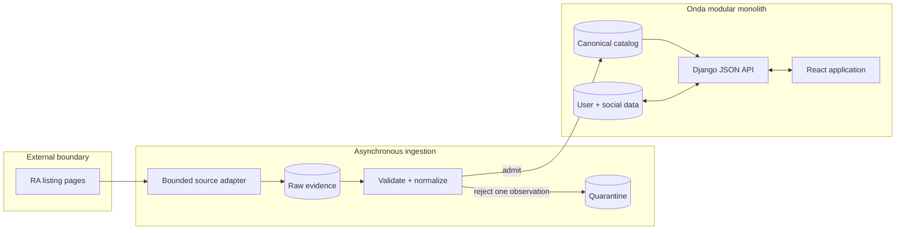
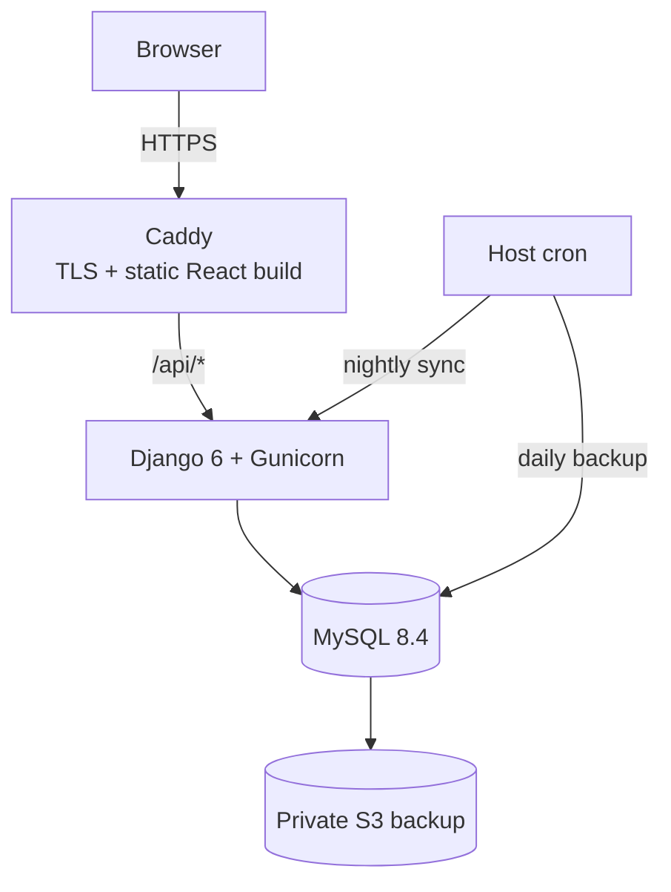

<p align="center">
  
</p>

<h1 align="center">Onda</h1>

<p align="center">
  A social diary for live music: discover events, remember what you attended, and follow the taste of people you trust.
</p>

<p align="center">
  <a href="https://ondaapp.io">Live demo</a> ·
  <a href="docs/README.md">Engineering documentation</a>
</p>

> **Demo video:** coming soon. The finished video will be added to this section as an MP4 repository asset.

## What Onda does

Onda turns a changing live-event catalog into a personal and social record. A user can browse upcoming and past events in New York City and Boston, mark plans, log attendance with a half-star rating, publish reviews, follow public or private profiles, and build favorite event, artist, and venue lists.

The interface is the visible product. The central engineering problem is the data behind it: live-music listings are fragmented, mutable, and not backed by a single complete, trusted catalog. Onda therefore treats external listings as fallible observations—not database truth.

[See the product as a user →](docs/PRODUCT_GUIDE.md)

## System at a glance



Onda is deliberately a **modular monolith**, not a distributed system. Django owns the ingestion, catalog, user, privacy, and API modules; MySQL provides the transactional boundary; React is a same-origin client. The external data source is asynchronous, so source latency or failure cannot enter a user request path.

## Where the engineering work is

- **Evidence before trust.** Every terminal page-fetch result is archived before parsing. A malformed response remains inspectable instead of disappearing into a log line.
- **Failure isolation.** Each listing observation is admitted in its own transaction. A bad event is quarantined without rolling back valid siblings or leaving a partial venue/artist/event graph.
- **Provider identity firewall.** Source IDs terminate in four identity-mapping tables. Product tables use canonical IDs and contain no Resident Advisor identifiers.
- **Safe absence handling.** Missing listings can hide an event only after a complete fetch and repeated misses. Incomplete data may add known-good observations; it may never subtract catalog state.
- **Query-time social feed.** Six activity types are combined with `UNION ALL`, privacy-filtered inside each branch, and cursor-paginated without a fan-out feed table.
- **Venue-local time.** Event state is evaluated in the venue city's IANA timezone, including upcoming/past classification and expiry of “Will Be There.”
- **Operational controls.** Production has mutual-exclusion locks, bounded retries and request budgets, health checks, rotating logs, daily backups, and a scheduled restore drill.

The source adapter is replaceable by design, but that statement has limits: **v1 has one implemented provider and still depends on it for coverage**. Adding another provider requires a new adapter plus deliberate entity mapping; it is not a configuration-only swap.

[Read the ingestion design →](docs/INGESTION.md) · [Follow canonical data through the application →](docs/APPLICATION_DATA.md)

## Documentation map

| Document | Question it answers |
|---|---|
| [Product guide](docs/PRODUCT_GUIDE.md) | What can a user do, and what rules do they see? |
| [Event ingestion](docs/INGESTION.md) | How does unreliable external data become trusted catalog state? |
| [Application data](docs/APPLICATION_DATA.md) | What happens after an event crosses into Onda? |
| [API](docs/API.md) | How do React, Django, sessions, errors, and pagination fit together? |
| [Database](docs/DATABASE.md) | What is the shipped schema and why is it divided this way? |
| [Evidence-level data flow](docs/DATA_FLOW.md) | Which code and tests enforce each path and invariant? |

## Measured and verified

The following is a reproducible engineering snapshot, not a claim about internet-scale traffic:

- **238 Django tests** passed against MySQL.
- **96 frontend tests** passed with Node's test runner.
- **13 captured ingestion fixtures** passed their contract audit.
- Django reported no pending model migrations.
- A committed local benchmark seeded **100,000 activity rows** across all six Home-feed branches. With 20 warm-ups followed by 200 measured requests, page 1 had a **45.908 ms p95** and page 50 a **31.618 ms p95**, while a test asserted four database queries. It used Django's in-process HTTP client on an Apple M4 Pro and excluded network/Gunicorn latency; it is a regression baseline, not a production load test. See [`feed-benchmark.yaml`](contracts/cv-mining/feed-benchmark.yaml).

Verified on **August 20, 2026**.

## Deployment snapshot

The live demo runs on a single AWS EC2 `t4g.small` host with Docker Compose:



Caddy is the only public container; Django and MySQL stay on the private Compose network. The host runs a five-minute health probe, a nightly source sync, daily database backups, log rotation, and a monthly restore-check job. Successful backup uploads and repeated health passes were observed. The restore check is scheduled but had not yet reached its first scheduled run when this snapshot was verified.

The latest completed ingestion run inspected was a backfill across two configured cities: both seeds succeeded, **1,919 observations were admitted, 1,128 were quarantined, and none were dropped**. “Admitted” counts valid source observations, not necessarily newly created unique events, because canonical writes are idempotent upserts.

[Read the deployment and operations runbook →](DEPLOY.md)

## Technology

- Python 3.12, Django 6.0.7, Gunicorn
- MySQL 8.4 in production
- React 19, React Router 7, Vite 8
- Docker Compose, Caddy, GitHub Actions
- Plain Django JSON views with session authentication and CSRF protection; no DRF or public API façade

## Run locally

Prerequisites: Python 3.12+, Node.js 22+, and MySQL 8.

```sh
python3 -m venv .venv
.venv/bin/pip install -r requirements.txt
cp .env.example .env
```

Create a MySQL database named `danced`, set the `DANCED_DB_*` values and a development `DJANGO_SECRET_KEY` in `.env`, then run:

```sh
.venv/bin/python manage.py migrate
.venv/bin/python manage.py runserver 127.0.0.1:8000
```

In another terminal:

```sh
cd frontend
npm install
npm run dev -- --host 127.0.0.1
```

Open [http://127.0.0.1:5173](http://127.0.0.1:5173). The source synchronization command is operator-facing; read [the ingestion guide](docs/INGESTION.md) and [operations runbook](docs/OPERATIONS.md) before running `manage.py sync_ra`.

## Current boundaries

- Onda has not been released as a consumer product or commercialized. The current deployment is an engineering demo. Before broader distribution or commercial use, I intend to contact Resident Advisor and reassess the source arrangement.
- The v1 source adapter reads a publicly reachable, unauthenticated Resident Advisor listing endpoint. It does not use credentials, cookies, CAPTCHA bypass, or challenge circumvention. Onda is not affiliated with Resident Advisor.
- No second event provider is implemented. The canonical model limits downstream coupling, but replacement still requires integration and entity-resolution work.
- Email-verification code exists, but enforcement and outbound transactional email are not enabled on the current demo deployment.
- Search-engine indexing is disabled on the demo. This does not restrict access; anyone with the URL can open it.
- Onda is independent of Resident Advisor, Letterboxd, Beli, and TMDB; those names and marks belong to their respective owners.

## Repository name

The project began under the internal codename **Danced** and was later named **Onda**. Stable internal identifiers such as the `DANCED_*` environment variables, database user-table name, and some historical document filenames remain intentionally unchanged; renaming them would create migration risk without changing the product.

## Rights

Copyright © 2026 Tan Baydar. All rights reserved.

This repository is public for inspection. Apart from the limited rights needed for GitHub to host the repository and provide public-repository features such as viewing and forking, **no license is granted** to use, copy, modify, distribute, sublicense, or create derivative works from its contents. GitHub explains the effect of publishing a repository without a license in its [licensing documentation](https://docs.github.com/en/repositories/managing-your-repositorys-settings-and-features/customizing-your-repository/licensing-a-repository).
