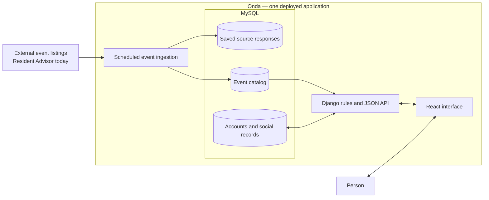
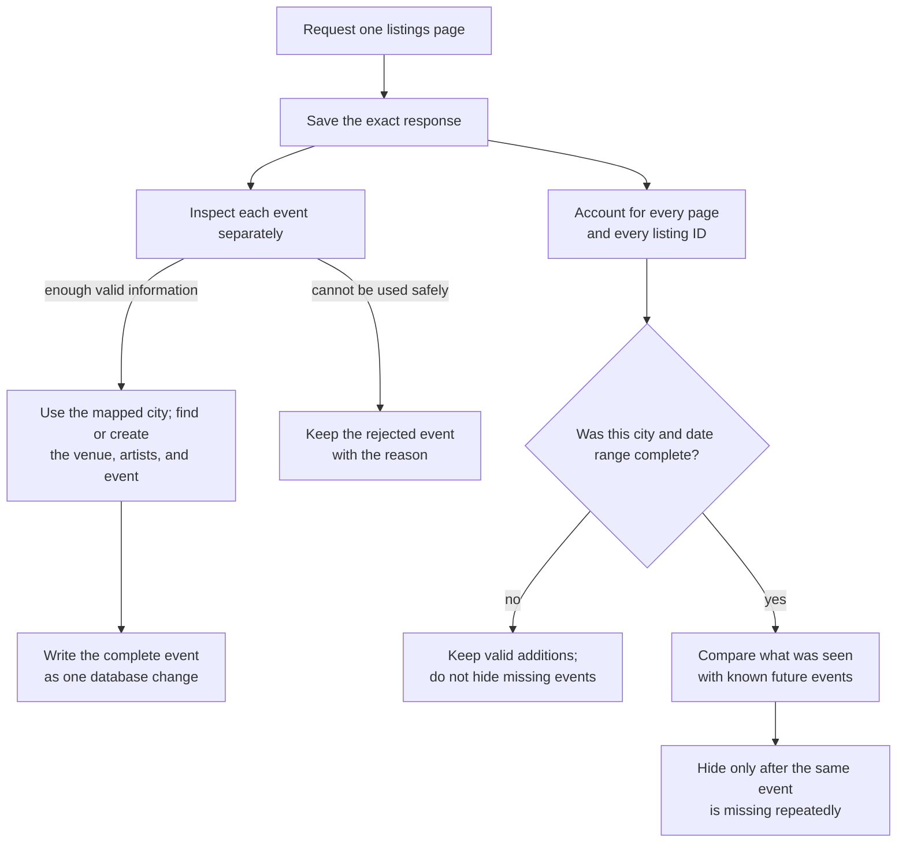
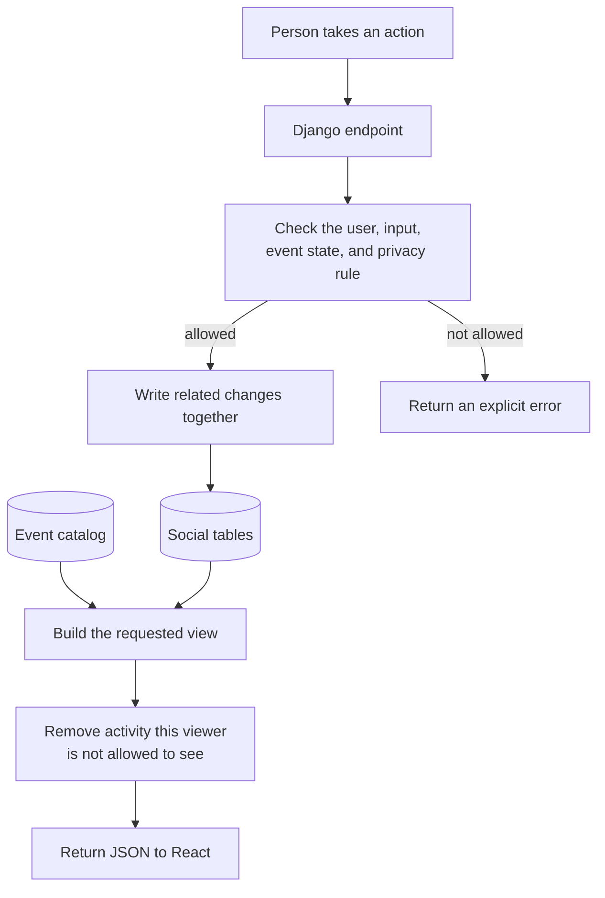

  

<h1 align="center">Onda</h1>

  A social diary for electronic-music events: discover shows, make plans,
  record ratings and reviews, and follow people whose taste you trust.

  <a href="https://ondaapp.io">Open the live demo</a>

## Demo

> **Video walkthrough coming soon.** A short MP4 or MOV demo will be placed here before the repository is made public.

## What can someone do with Onda?

- Browse upcoming and recent events by city.
- Mark an upcoming event as **Will Be There**.
- Add a past event to **Been**, rate it in half-star steps, and write a review.
- Follow public profiles or request access to private profiles.
- See activity from followed people and keep favorite events, artists, and venues.

[See the product from a user's perspective →](docs/PRODUCT_GUIDE.md)

## The entire system in one picture

Onda is a **modular monolith**. In practical terms, it is one Django application, one MySQL database, and one React interface—not a collection of microservices and not a distributed platform.

Event collection happens on a schedule, outside normal user requests. Opening an event, publishing a review, or loading Home reads data already owned by Onda; it does not wait for Resident Advisor.

## A closer look: how event data enters Onda

An event listing is not trusted merely because a request returned successfully. Onda first preserves what arrived, then decides what it can safely add to the product.

### 1. Keep what arrived

Onda saves the exact final response before trying to interpret it. If the source changes shape or returns malformed data, the evidence remains available for diagnosis and replay. This saved copy is the pipeline's **raw evidence**.

### 2. Decide one event at a time

Each listing is checked independently. A valid event can still enter the catalog when another event on the same page is unusable.

For one accepted event, its venue, artists, event row, source mappings, and lineup are written together. Either the entire set succeeds or none of it remains partially written. That is the role of the database **transaction**.

An unusable listing is retained with its source reference and a concrete reason instead of being silently discarded. Onda calls this **quarantine**.

### 3. Remember which real-world record it is

Resident Advisor IDs are stored only in mapping tables at the ingestion boundary. Product tables use Onda's own IDs.

When the same source ID appears again, Onda updates the existing event instead of creating a duplicate. A future provider could map into the same catalog, although building that adapter and resolving overlap would still be real engineering work. This is the **identity-mapping** boundary.

### 4. Do not treat one absence as deletion

Only a complete city-and-date fetch may change Onda's opinion about events that were not returned. An incomplete fetch may add valid information, but it cannot hide anything.

After a complete fetch, a missing future event receives a miss. Reappearing resets the count; three consecutive misses hide the event from normal reads. The row and its user history are preserved. This is Onda's **reconciliation** rule.

[Read the complete ingestion explanation →](docs/INGESTION.md)

## A closer look: what happens after ingestion

Once an event is in the catalog, people create a separate layer of data around it: plans, Been entries, ratings, reviews, follows, favorites, and notifications.

For example, a rating request does not write directly from React to MySQL. Django verifies the session and CSRF token, checks that the event can be rated, validates the rating, and then creates or updates the related Been data as one change.

Reads follow the same rule. Privacy is applied before a response is serialized—not after private activity has already been sent to the browser.

Home is also built from existing social records rather than maintained as a second copied timeline. When Home is requested, Django combines the activity the viewer may see, orders it, and returns one cursor-paginated page.

[Read the social-data architecture →](docs/APPLICATION_DATA.md)

## Three ways into the repository

- [Use Onda](docs/PRODUCT_GUIDE.md): the features and user journey, without implementation detail.
- [Follow event ingestion](docs/INGESTION.md): how outside listings become catalog data.
- [Follow social data](docs/APPLICATION_DATA.md): how catalog events become private and public user activity.

## Current scope

- Onda currently has one implemented event source: Resident Advisor. The internal boundary reduces source coupling, but coverage still depends on that source today.
- The source endpoint is publicly reachable and unauthenticated. Onda does not use credentials, cookies, CAPTCHA bypass, or challenge circumvention.
- Onda is an engineering demo, not a released or commercialized consumer product. Before broader distribution or commercial use, I intend to contact Resident Advisor and reassess the source arrangement.
- Onda is not affiliated with Resident Advisor.

The repository began under the codename **Danced**. Some stable internal identifiers retain that name to avoid unnecessary migration risk.

## Rights

Copyright © 2026 Tan Baydar. All rights reserved. No license is granted to use, copy, modify, distribute, sublicense, or create derivative works from this repository.
