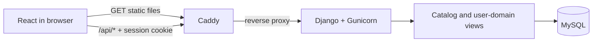
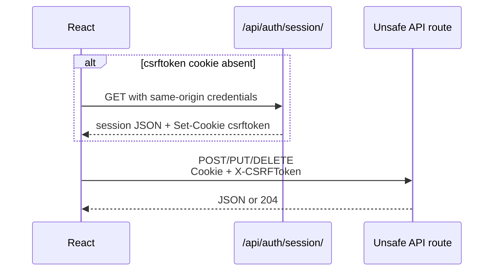

# Onda first-party JSON API

Onda uses plain Django JSON views as the boundary between the React application and the backend. It is a **first-party application API**, not a documented public developer platform: there is no DRF dependency, token-auth product, OpenAPI specification, or compatibility promise for third-party clients.

This page documents the shipped HTTP surface so its behavior can be reviewed without reading every view.

## Request architecture

Production serves the frontend and API from the same origin:



The React wrapper sends `credentials: "same-origin"` on every request. Django's session middleware resolves the user; unsafe requests also require Django's CSRF cookie/header pair.

## Session and CSRF contract

`GET /api/auth/session/` is the browser bootstrap. It sets a CSRF cookie and returns one of these shapes:

```json
{"authenticated": false, "user": null}
```

```json
{
  "authenticated": true,
  "user": {
    "id": 42,
    "email": "shown-only-to-the-account-owner@example.com",
    "username": "listener",
    "display_name": "Listener",
    "is_private": false
  }
}
```

Email belongs only to the authenticated user's own session payload. Other-user serializers do not include it.

The frontend's write sequence is:



Authentication and account-action eligibility are separate checks. An unauthenticated write returns `401`. If email-verification enforcement is enabled, an authenticated but unverified account receives `403` for product actions. Enforcement is disabled on the current demo deployment.

## Catalog and search

These endpoints are readable without authentication. When a session exists, detail responses may add viewer-specific state.

| Method | Path | Purpose and important inputs |
|---|---|---|
| `GET` | `/api/cities/` | Supported canonical cities |
| `GET` | `/api/search/` | Search events, artists, venues, and people; `q`, optional `scope`, `city_id`, `cursor` |
| `GET` | `/api/events/` | Upcoming/past catalog; requires `when` and exactly one of `city_id`, `venue_id`, `artist_id`; optional `page`, `page_size` |
| `GET` | `/api/events/{event_id}/` | Event, venue/city, ordered lineup, rating and viewer state |
| `GET` | `/api/venues/{venue_id}/` | Canonical venue and city |
| `GET` | `/api/artists/{artist_id}/` | Canonical artist |

`/api/events/` caps `page_size` at 100 and uses deterministic date/ID ordering. Hidden events are filtered from list and detail routes. A hidden ID and an unknown ID deliberately produce the same `404` surface.

A serialized catalog event has this stable core:

```json
{
  "id": 847,
  "title": "Example event",
  "event_date": "2026-08-22",
  "start_time": "22:00:00",
  "cover_image_url": "https://example.invalid/image.jpg",
  "venue": {
    "id": 91,
    "name": "Example venue",
    "city": {"id": 2, "name": "Boston", "timezone": "America/New_York"}
  },
  "artists": [
    {"id": 203, "name": "Example artist", "position": 1}
  ]
}
```

Internal source IDs and event lifecycle status are not serialized.

## Authentication and account recovery

| Method | Path | Access | Purpose |
|---|---|---|---|
| `GET` | `/api/auth/session/` | Public | Bootstrap session and CSRF state |
| `POST` | `/api/auth/register/` | Public | Create an account and log it in; returns `201` |
| `POST` | `/api/auth/login/` | Public | Authenticate by username or email plus password |
| `POST` | `/api/auth/logout/` | Session optional | Clear the session; returns `204` |
| `POST` | `/api/auth/verification/request/` | Authenticated session | Issue a six-digit verification code |
| `POST` | `/api/auth/verification/confirm/` | Authenticated session | Verify a code and mark email verified |
| `POST` | `/api/auth/password-reset/request/` | Public | Accept a reset request without revealing account existence |
| `POST` | `/api/auth/password-reset/confirm/` | Public | Validate code and replace password |

Account codes are stored as hashes, expire after 15 minutes, allow at most five failed attempts, and have a 60-second resend cooldown. The request endpoint returns the same accepted response whether or not an email exists to reduce account enumeration.

The code paths are implemented and tested, but outbound transactional email is not configured in the current live demo. They should not be interpreted as a currently usable production email flow.

## Public and visibility-controlled social reads

“Public” below means that an anonymous request is accepted; it does not mean every target profile's content is public. Private-profile routes return a privacy boundary response unless the viewer owns the account or has an approved follow.

| Method | Path | Purpose |
|---|---|---|
| `GET` | `/api/users/{username}/` | Profile identity and viewer relationship state |
| `GET` | `/api/users/{username}/been/` | Paginated diary entries |
| `GET` | `/api/users/{username}/reviews/` | Paginated/sortable profile reviews |
| `GET` | `/api/users/{username}/favorites/` | Favorite events, artists, and venues |
| `GET` | `/api/users/{username}/stats/` | Diary, review, venue/city, rating, and follow statistics |
| `GET` | `/api/events/{event_id}/reviews/` | Public/visible event reviews with sort and pagination |
| `GET` | `/api/events/{event_id}/will-be-there/public/` | Public-profile active attendance intent |

## Authenticated diary and event actions

| Method | Path | Result |
|---|---|---|
| `PUT` | `/api/events/{event_id}/been/` | Create/update a half-star rating; `201` or `200` |
| `DELETE` | `/api/events/{event_id}/been/` | Remove Been and dependents; `204`, or `404` if absent |
| `DELETE` | `/api/events/{event_id}/been/rating/` | Keep Been, remove rating and dependent review/likes; returns cascade detail |
| `PUT` | `/api/events/{event_id}/been/review/` | Create/update review; `201` or `200` |
| `DELETE` | `/api/events/{event_id}/been/review/` | Remove review; `204`, or `404` if absent |
| `POST` | `/api/reviews/{review_id}/like/` | Add a like; `201`, or `409` on a conflicting repeat/self action |
| `DELETE` | `/api/reviews/{review_id}/like/` | Remove a like; `204`, or `404` if absent |
| `PUT` | `/api/events/{event_id}/will-be-there/` | Create or confirm attendance intent; `201` or `200` |
| `DELETE` | `/api/events/{event_id}/will-be-there/` | Remove attendance intent idempotently; `204` |
| `GET` | `/api/events/{event_id}/will-be-there/circle/` | Active intent from approved followees |
| `GET` | `/api/events/{event_id}/circle/` | Viewer/circle rating summary and diary state |

Example rating write:

```http
PUT /api/events/847/been/
Content-Type: application/json
X-CSRFToken: <cookie value>

{"rating": 4.5}
```

```json
{
  "entry": {
    "id": 501,
    "rating": 4.5,
    "rated_at": "2026-08-20T18:12:00Z",
    "created_at": "2026-08-20T18:12:00Z",
    "review": null
  }
}
```

The route rejects non-half-star values with `400` and a not-yet-started event with `409`.

## Authenticated profile, follow, and favorite actions

| Method | Path | Purpose |
|---|---|---|
| `PUT` | `/api/me/profile/` | Edit display name, bio, home city, and avatar URL fields accepted by the profile contract |
| `POST`, `DELETE` | `/api/me/profile/avatar/` | Upload/process or remove avatar media |
| `PUT` | `/api/me/privacy/` | Change public/private state transactionally |
| `POST`, `DELETE` | `/api/users/{user_id}/follow/` | Follow/request or unfollow |
| `GET` | `/api/me/follow-requests/` | Pending inbound requests |
| `POST` | `/api/me/follow-requests/{follower_id}/accept/` | Approve request |
| `POST` | `/api/me/follow-requests/{follower_id}/decline/` | Decline request |
| `PUT`, `DELETE` | `/api/events/{event_id}/favorite/` | Add/remove event favorite |
| `PUT`, `DELETE` | `/api/artists/{artist_id}/favorite/` | Add/remove artist favorite |
| `PUT`, `DELETE` | `/api/venues/{venue_id}/favorite/` | Add/remove venue favorite |
| `GET` | `/api/me/favorite-venues/` | Paginated viewer-only venue favorites |
| `GET` | `/api/me/been/` | Viewer-only diary management list |

Each favorite type has a three-item service cap. `PUT` is idempotent for an already-favorited target; `DELETE` is idempotent and returns `204` whether or not the row existed.

Avatar uploads are validated as images, normalized with Pillow, stripped of metadata by decode/re-encode, resized to the configured square output, and stored through Django's storage interface. The public profile stores a URL rather than exposing a filesystem path.

## Home and notifications

| Method | Path | Pagination/action |
|---|---|---|
| `GET` | `/api/me/home/` | Six-source Home projection; opaque composite cursor |
| `GET` | `/api/me/notifications/` | Notification list; timestamp/ID cursor |
| `POST` | `/api/me/notifications/{notification_id}/read/` | Mark one owned notification read |
| `POST` | `/api/me/notifications/read-all/` | Mark all owned notifications read |

Home's cursor encodes the complete order key `(activity_at, activity_type, source_key)`. Notifications use `(created_at, id)`. Both are better suited to a changing timeline than a numeric page: newly inserted rows do not shift the already-traversed boundary.

## Pagination contracts

Onda uses three forms deliberately:

| Form | Used by | Response behavior |
|---|---|---|
| Page number | Stable event/profile/review/attendee/favorite lists | `page`, `page_size`, totals, next/previous page; out-of-range is `404` |
| Opaque keyset cursor | Home and notifications | Stable next boundary over a complete compound ordering key |
| String offset cursor | Scoped search | `next_cursor` is the next numeric offset encoded as a string |

Search uses `scope=all` for up to five results in each group, or one of `events`, `artists`, `venues`, `people` for a 20-result paginated group. Search recents are a frontend `localStorage` feature and never enter the API/database.

## Status and error semantics

| Status | Meaning in this API |
|---:|---|
| `200` | Successful read or update; also an idempotent existing-resource `PUT` |
| `201` | Resource/relationship created |
| `204` | Successful response with no JSON body |
| `400` | Malformed JSON, invalid field, query, cursor, or pagination input |
| `401` | Session authentication required or login credentials invalid |
| `403` | Private-profile boundary or account action blocked by verification policy |
| `404` | Unknown, hidden, not visible, absent relationship where required, or page out of range |
| `409` | Valid input conflicts with domain state or a uniqueness/action rule |
| `429` | Account-code resend cooldown |
| `405` | Route exists but does not allow that HTTP method |

Validation responses normally use field-oriented `{"errors": {...}}`; a few resource and pagination paths return a singular `{"error": "..."}`. That inconsistency is part of the current first-party contract and is not presented as a uniform public API design.

## API security boundary

- Cookies are same-origin; unsafe methods require `X-CSRFToken`.
- Production settings enforce HTTPS redirect, secure cookies, HSTS, MIME sniffing protection, and frame denial.
- Django's session ID, password hashes, verification-code hashes, and self-only email fields are never part of public serializers.
- Visibility querysets filter private content before serialization.
- Hidden catalog objects resolve through the same not-found surface as unknown IDs.
- Password-reset requests do not reveal whether an email exists.
- Avatar content is decoded and re-encoded rather than trusted by filename or declared MIME type.

This is a web-application boundary, not an authorization model for third-party API clients. There are no API keys, OAuth scopes, rate plans, or public service-level guarantees.

## Implementation map

| Concern | Source |
|---|---|
| Top-level route composition | `backend/config/urls.py` |
| Auth routes | `backend/users/urls.py` |
| Product/social routes | `backend/users/been_urls.py` |
| Catalog views/serialization | `backend/catalog/views.py` |
| Search | `backend/catalog/search.py` |
| User views/serialization | `backend/users/views.py` |
| Domain transactions | `backend/users/services.py` |
| Browser fetch and CSRF wrapper | `frontend/src/api.js` |

For data behavior behind these endpoints, continue with [APPLICATION_DATA.md](APPLICATION_DATA.md). For table relationships, see [DATABASE.md](DATABASE.md).
