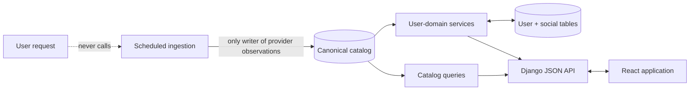
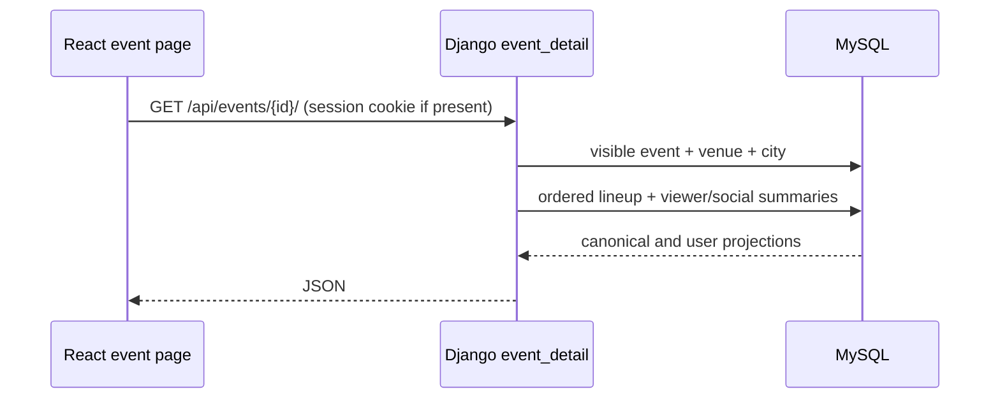
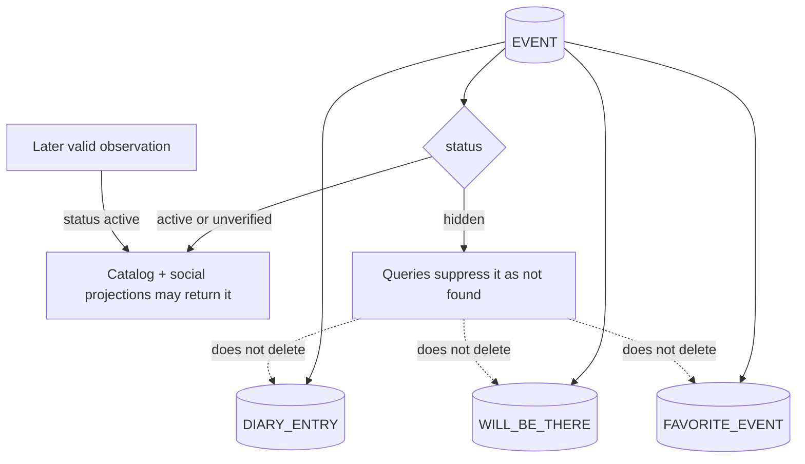
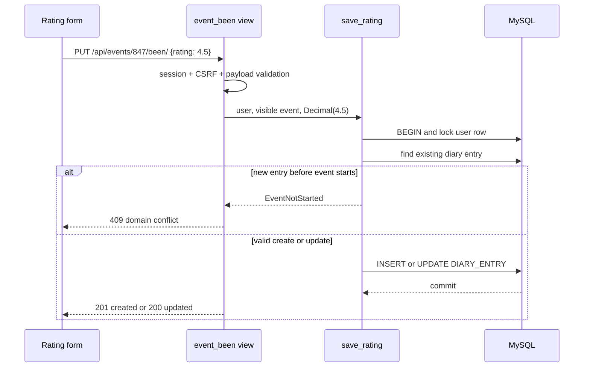
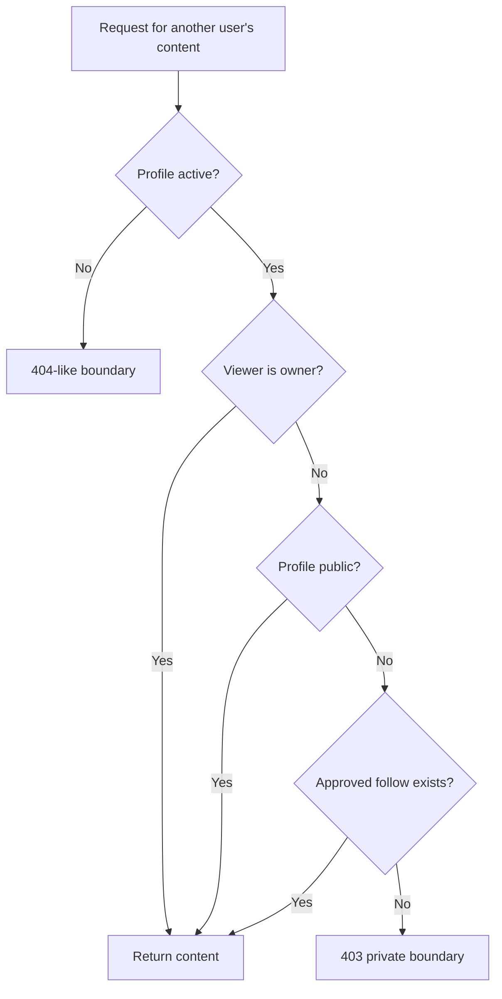
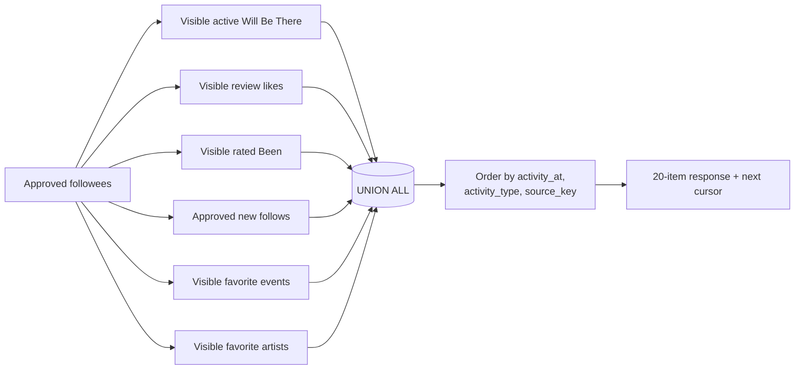

# Application data: what happens after ingestion

The ingestion layer ends when a validated observation becomes canonical `CITY`, `VENUE`, `ARTIST`, `EVENT`, and `EVENT_ARTIST` state. From that point onward, Onda behaves like a conventional transactional web application: product requests read canonical rows and write user-owned relationships around them.

This page follows those reads and writes. It does not repeat acquisition internals; see [INGESTION.md](INGESTION.md) for the external boundary.

## The product boundary

There is no provider fetch in search, event detail, profile, or Home. If the source becomes unavailable, users can continue reading existing canonical and social state; the catalog simply stops receiving fresh observations.

The application is a **modular monolith**:

| Module | Owns |
|---|---|
| `catalog` | Canonical cities, venues, artists, events, lineups, catalog search/read behavior |
| `users` | Accounts, privacy, follows, diary entries, reviews, plans, favorites, notifications, Home |
| `ingestion` | Scheduled provider acquisition, evidence, admission, and reconciliation |
| `config` | Django settings, routing, source enumeration, deployment configuration |
| `frontend` | React routes, components, state, and same-origin API calls |

These boundaries are code/module boundaries, not network services. They share one Django process and one MySQL database so domain operations can use ordinary transactions and foreign keys.

That is an intentional scale decision. Ingestion, catalog, and social traffic do not currently require independent scaling or separate team ownership, while several writes benefit from one ACID transaction. Splitting them into services now would add network failure modes, distributed transactions, deployment surface, and observability work without solving a measured bottleneck. The module seams leave room for a future split if operational evidence justifies it.

## Canonical reads

Catalog endpoints query canonical models only. Event queries join the venue and city and prefetch the artist lineup in its stored order.

Upcoming and past lists have deterministic ordering:

- upcoming: `(event_date ASC, id ASC)`;
- past: `(event_date DESC, id DESC)`.

The secondary ID key prevents overlap or reordering when multiple events share a date. List pages use page-number pagination because this catalog ordering is stable enough for direct navigation.

## Event lifecycle protects user history

The canonical event has an internal lifecycle: `active`, `unverified`, or `hidden`. Public catalog queries expose the first two and suppress the third. The API never serializes the lifecycle field.

Hiding is therefore a read-time projection, not a destructive cleanup. Been entries, reviews, likes, plans, and favorites remain attached to the canonical event. If ingestion sees the event again, the same user records reappear without reconstruction.

## User writes go through domain services

JSON views validate HTTP input and authentication, then delegate state transitions to service functions. Multi-row invariants use `transaction.atomic()` and row locks where concurrent requests could violate a cap or relationship rule.

### Worked example: rating and reviewing an event

Important invariants exist in both service logic and database constraints:

- one diary entry per `(user, event)`;
- rating is null or one of the half-star values from 0.5 through 5.0;
- `rating` and `rated_at` are null or populated together;
- one review per diary entry;
- a review requires an existing rating and nonblank body;
- removing a rating transactionally deletes its dependent review and likes but preserves the Been row;
- deleting Been cascades through its review and likes.

The API returns `409 Conflict` for validly shaped requests that violate the current domain state—for example, logging an event before it starts or publishing a review without a rating. This keeps transport validation (`400`) distinct from business conflicts (`409`).

## Privacy is applied before serialization

Privacy is not a frontend display preference. Named querysets such as `visible_to(viewer)`, `for_circle(viewer)`, and `for_public_section()` build it into database selection.

The same principle applies to content embedded in Home, event reviews, public/circle attendance, profile statistics, and diary lists. Private rows are filtered out in SQL rather than returned to React with a “hidden” flag.

Private ratings can contribute anonymously to an event-wide aggregate because the aggregate reveals no author. Named review, diary, plan, and feed projections remain subject to profile visibility.

## Home is a projection, not a ledger

Onda does not copy every social action into a fan-out feed table. `GET /api/me/home/` constructs a viewer-specific projection from six existing sources:

Each branch emits the same projection shape. Privacy and event-lifecycle predicates are inside the branch, before union and pagination. This is important: filtering afterward could produce short pages, leak row existence, or make cursors inconsistent.

The stable cursor key is `(activity_at, activity_type, source_key)`. Timestamp alone is insufficient because several activities can share the same time; the type and source key make ordering total and repeatable.

### Why query-time assembly is the current choice

At Onda's current scale, it offers useful consistency properties:

- deleting or changing a source record immediately changes the feed;
- changing privacy does not require repairing copied feed rows;
- hiding an event suppresses related activity without destroying it;
- there is no write amplification to every follower;
- no worker queue or eventually consistent fan-out process is required.

The tradeoff is read complexity. A committed regression benchmark therefore covers all six branches with 100,000 total activity rows. Through Django's in-process HTTP client and production middleware, page 1 measured 45.908 ms p95 and page 50 measured 31.618 ms p95 over 200 measured requests after 20 warm-ups. A contract test asserts four queries. The machine was an Apple M4 Pro with a dedicated local MySQL database; the result excludes deployed network and Gunicorn latency and is not a load-capacity claim.

The complete methodology and seed distribution are in
[`benchmarks/home-feed/results.yaml`](../benchmarks/home-feed/results.yaml).

## Time belongs to the venue

Events store a local `event_date` and optional local `start_time`; the related city stores an IANA timezone such as `America/New_York`. The application converts the current instant into that timezone before deciding state.

| Decision | Venue-local rule |
|---|---|
| Upcoming | `event_date >= local_today` |
| Past | `event_date < local_today` |
| Can create Been | local wall time has reached date + start time; midnight if time is unknown |
| Will Be There active | `local_today <= event_date` |

This prevents a server timezone—or a user's travel timezone—from changing whether a Boston event is “today.” Artist pages can span cities, so the date predicate is built per participating city rather than from one global date.

## Follows, favorites, and notifications

### Follows

`FOLLOW` has a composite primary key `(follower_id, followee_id)` and disallows self-follow. A public follow is immediately `approved`; a private follow begins `pending` with no approval timestamp. Status and timestamp consistency is enforced by a database check.

Privacy changes are service operations, not a single flag flip. When a private account becomes public, pending requests are resolved consistently inside the transaction.

### Favorites

Event, artist, and venue favorites each use `(user_id, target_id)` as a composite primary key. The maximum of three per target type is enforced by locking the user's row while checking and inserting, so concurrent requests cannot both pass a stale count.

Favorite event and artist actions contribute to Home. Favorite venue is used on profiles and personalized venue access but is not one of the six feed branches.

### Notifications

Notifications represent review likes, follows, follow requests, and request acceptance. Each row has a recipient, a distinct actor, type, optional review reference, creation time, and read time. A check constraint requires a review only for the `review_like` type.

Notification pagination uses `(created_at, id)` cursors. Marking one or all rows as read is an authenticated write; fetching the list does not mutate unread state.

## Deletion and foreign-key intent

Foreign keys express two different ownership relationships:

- **User-owned dependents cascade.** Deleting a user removes account codes, follows, diary entries, review likes, plans, favorites, and notifications. Deleting a diary entry removes its review; deleting a review removes its likes and review-linked notifications.
- **Canonical references restrict.** User records do not cascade-delete an event, artist, or venue. Canonical records are shared catalog identity and cannot be removed while referenced through ordinary application deletion.

Django's `on_delete=models.CASCADE` controls ORM behavior but does not automatically guarantee an equivalent physical `ON DELETE CASCADE` clause in MySQL. Migrations in this repository explicitly corrected and verify the physical foreign-key actions for user-owned relationships. The database therefore preserves the same deletion contract outside a single Django code path.

## What is stored versus derived

| Concern | Stored | Derived at read time |
|---|---|---|
| Event identity | Canonical ID + provider mapping | — |
| Event lifecycle | `EVENT.status`, identity miss counters | Whether normal product queries expose it |
| Will Be There | User/event pair + creation time | Whether the mark is still active |
| Follow | Pair, status, timestamps | Whether content is visible to this viewer |
| Community rating | Individual diary ratings | Count/average and minimum-count state |
| Home | Source actions only | Unified six-type feed and cursor page |
| Recent searches | Browser `localStorage` | Display order in that browser |

The distinction prevents duplicated state where the source data already provides a stronger truth. In particular, there is no `FEED` table, stored Will-Be-There expiry, or shipped `RECENT_SEARCH` database table.

## Code map

| Concern | Primary implementation |
|---|---|
| Canonical models and event query base | `backend/catalog/models.py`, `backend/catalog/views.py` |
| Search | `backend/catalog/search.py` |
| User/social models and visibility querysets | `backend/users/models.py` |
| Transactional domain operations | `backend/users/services.py` |
| First-party JSON views | `backend/users/views.py` |
| Home query construction | `backend/users/home_feed.py` |
| Frontend API boundary | `frontend/src/api.js` |
