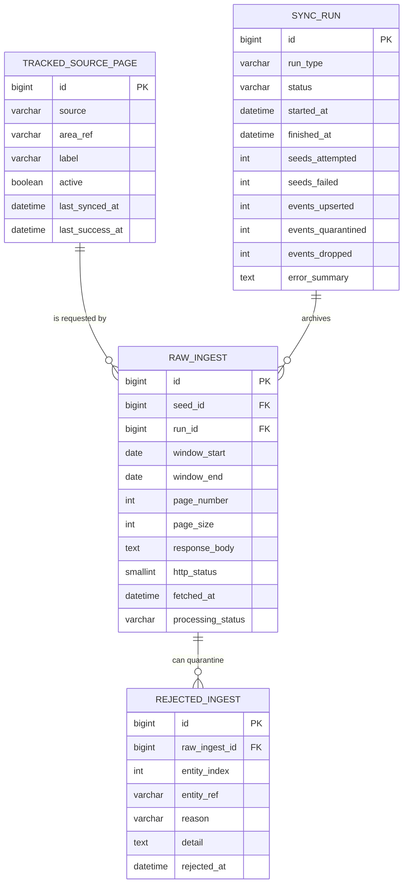
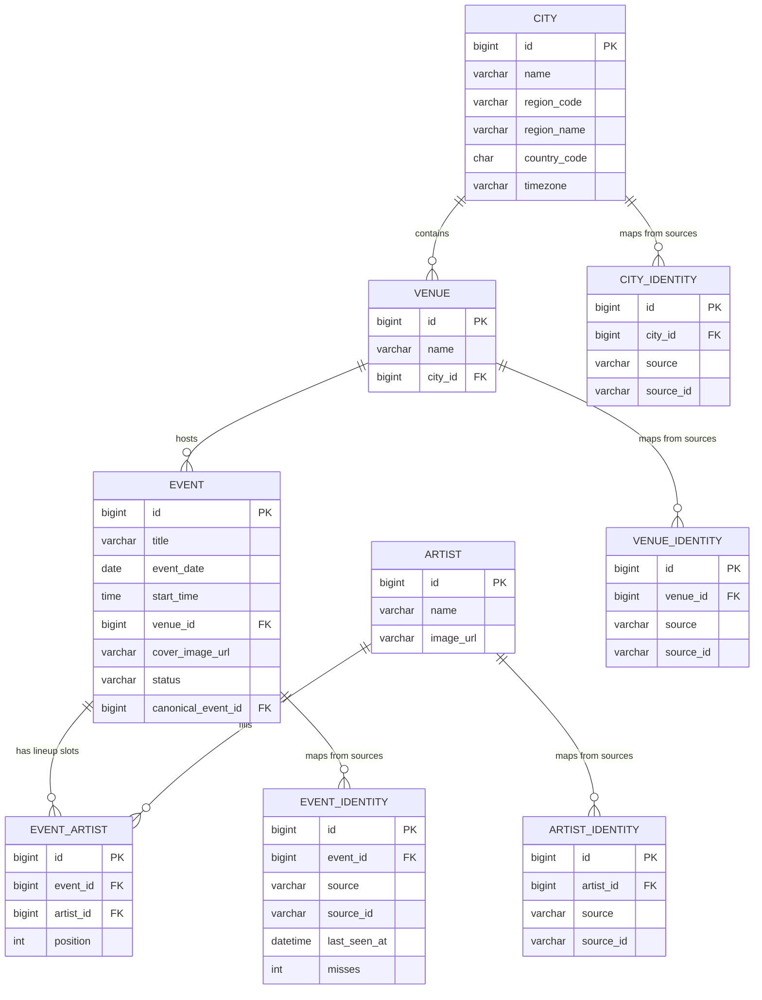
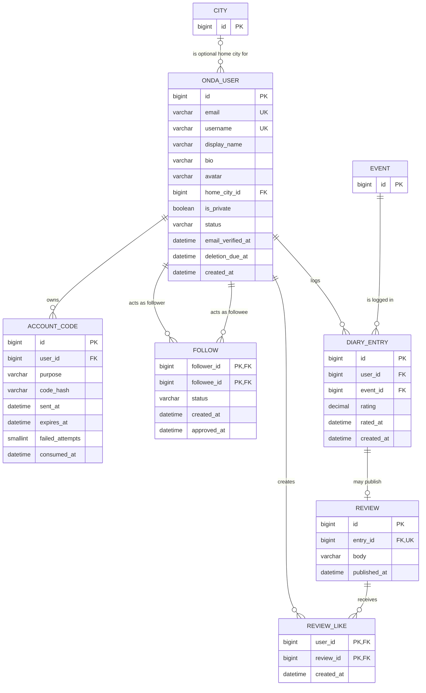
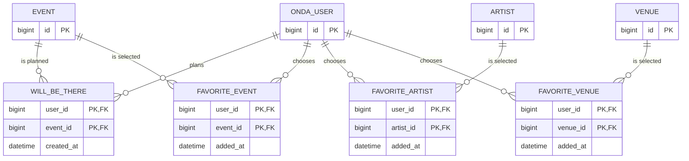
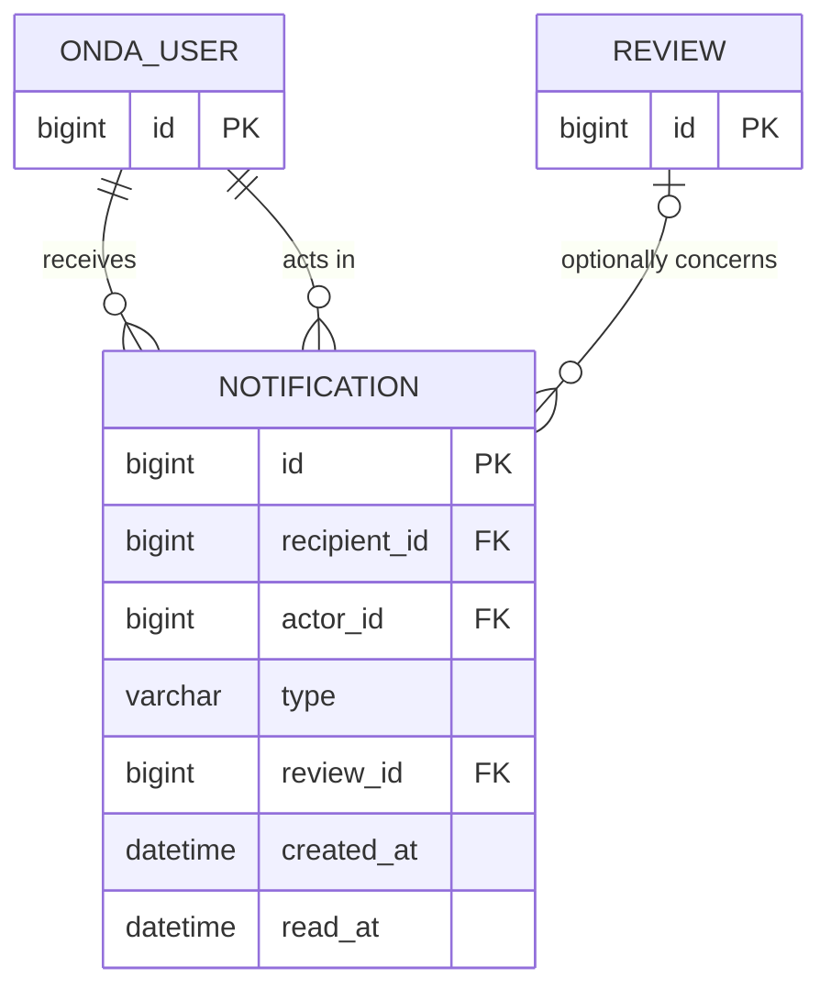
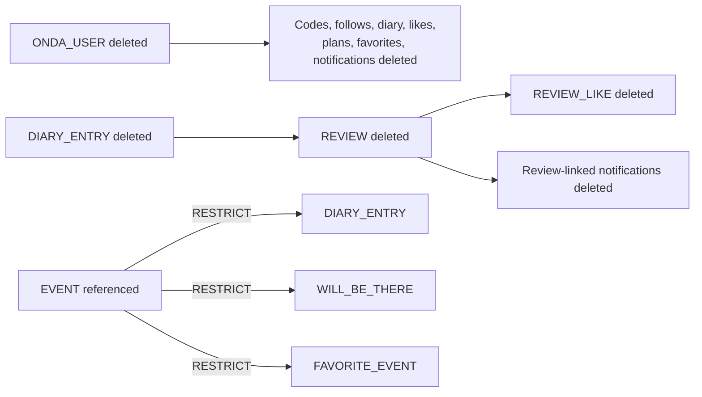

# Shipped database: crow's-foot reference

This document describes the **implemented Onda product schema** as of August 20, 2026. It is derived from the current Django models and migrations: 24 project-owned tables across ingestion, canonical identity, and application data.

It deliberately excludes Django framework tables and generated framework junctions for admin, permissions, groups, content types, migrations, and sessions. Those tables exist in the deployed database but do not express Onda's domain model.

## Read the notation

| Mark | Meaning |
|---|---|
| `||` | exactly one |
| `o|` | zero or one |
| `o{` | zero or many |
| `PK` | primary key |
| `FK` | foreign key |
| `UK` | unique key |

The diagrams show physical relationship cardinality. A stricter service invariant is called out in prose when the database alone cannot express it—for example, ingestion admits an event with at least one artist, but a foreign key cannot force every `EVENT` row to have an `EVENT_ARTIST` child at every instant.

## Three data zones

```mermaid
flowchart LR
    subgraph IZ[Ingestion evidence — 4 tables]
        Seeds[Tracked source pages]
        Runs[Run telemetry]
        Raw[Raw responses]
        Rejected[Quarantined observations]
    end

    subgraph CZ[Canonical + identity — 9 tables]
        Canon[City / venue / artist / event / lineup]
        Identity[Four provider identity maps]
    end

    subgraph AZ[Application — 11 tables]
        Accounts[Accounts + follows]
        Diary[Diary + reviews + likes]
        Social[Plans + favorites + notifications]
    end

    IZ -->|Transformer only| CZ
    CZ -->|canonical foreign keys| AZ
```

There is intentionally no foreign key from application tables back to ingestion evidence. Provider-shaped data ends at the Transformer and identity mappings.

## 1. Ingestion evidence

Key constraints:

- `TRACKED_SOURCE_PAGE(source, area_ref)` is unique.
- `SYNC_RUN.run_type` is one of `nightly`, `backfill`, `replay`; status is `running`, `completed`, or `crashed`.
- `RAW_INGEST.processing_status` is `pending`, `processed`, or `failed`.
- `REJECTED_INGEST(raw_ingest_id, entity_index)` is unique, so replay cannot duplicate the same occurrence.
- Raw-to-seed, raw-to-run, and rejected-to-raw deletion behavior is restrictive. Evidence cannot disappear through an ordinary parent cascade.

`RAW_INGEST` has operational indexes on `run_id` and `(seed_id, fetched_at)`. The raw response is text rather than a native JSON column so a malformed or non-JSON body can still be preserved exactly.

## 2. Canonical catalog and provider identities

Composite uniqueness that cannot be expressed field-by-field in the compact diagram:

- `CITY(country_code, region_code, name)`;
- `EVENT_ARTIST(event_id, artist_id)` and `EVENT_ARTIST(event_id, position)`;
- every identity table: `(source, source_id)` and `(canonical_id, source)`.

Canonical records never store an RA ID. A provider ID is unique only inside its `(entity type, source)` namespace and resolves through the matching identity table. This supports stable Onda IDs when provider display attributes change and creates a place for another source identity if a future integration deliberately maps it to the same real entity.

`EVENT.status` is constrained to `active`, `unverified`, or `hidden`. `EVENT_IDENTITY.misses` and `last_seen_at` retain the source testimony used to derive that status. Catalog indexes support `(status, event_date)` and `(venue_id, event_date)` reads.

A provider can occasionally publish separate source IDs for the same show. When title, venue, local date/time, and ordered lineup all agree, the later `EVENT` row retains its own identity evidence but points to the earliest row through `canonical_event_id`. Catalog reads expose only the canonical row, old alias URLs resolve to it, and lifecycle reconciliation considers evidence from the whole alias group. The migration only marks groups that have no user-owned Been, Will Be There, or favorite data; it never deletes source or event rows.

Deletion intent differs by relationship:

- deleting a canonical city, venue, artist, or event is restricted while downstream canonical/product references exist;
- deleting an event cascades through its lineup and provider identity rows only after those restrictions have been resolved;
- deleting an artist is restricted by lineup use;
- canonical deletion is not the normal response to source absence—lifecycle status is.

## 3. Application and social data

### Accounts, follows, and publishing

### Plans and favorites

### Notifications

`ONDA_USER` is the custom Django user table. It also contains framework account
fields such as the password hash and staff/activity flags, omitted above so the
domain relationships remain readable.

### Composite identities and caps

The following relationships use composite primary keys, which makes “the same relationship twice” physically impossible:

- `FOLLOW(follower_id, followee_id)`;
- `REVIEW_LIKE(user_id, review_id)`;
- `WILL_BE_THERE(user_id, event_id)`;
- each of the three favorite tables `(user_id, target_id)`.

`DIARY_ENTRY` uses a surrogate primary key but makes `(user_id, event_id)` unique because `REVIEW.entry_id` needs a stable one-to-one parent. Favorite counts—at most three events, artists, and venues per user—are cross-row rules enforced transactionally in the service layer rather than by a simple row check.

### Checks that encode product laws

Representative database checks include:

- an active user must have a username; deactivated/pending-deletion users must not;
- only a pending-deletion user has `deletion_due_at`;
- account-code expiry is after send time and failed attempts are at most five;
- a user cannot follow themself;
- pending follows have no approval time and approved follows do;
- diary `rating` and `rated_at` are null or populated together;
- rating is null or a valid half-star value from 0.5 through 5.0;
- review body cannot be whitespace-only;
- notification actor and recipient differ;
- only `review_like` notifications have a review reference.

Some domain laws require transactions rather than row-local checks: an event must have started before the first Been entry, a review needs a rating, Will Be There expires by venue-local date, favorite lists have caps, and viewer privacy depends on an approved follow relationship.

### Cascades and restrictions

User-owned data uses physical MySQL cascades:

Django ORM cascade declarations do not automatically mean MySQL emitted the same physical `ON DELETE` action. The migration history explicitly rebuilds and tests those foreign keys, so the ownership policy survives direct database enforcement as well as ORM deletion.

## Indexes aligned with read paths

The schema uses targeted indexes rather than indexing every foreign key twice:

| Index | Read path |
|---|---|
| `EVENT(status, event_date)` | visible upcoming/past catalog |
| `EVENT(venue_id, event_date)` | venue event lists |
| `RAW_INGEST(run_id)` | run recovery and diagnostics |
| `RAW_INGEST(seed_id, fetched_at)` | source-page history |
| `FOLLOW(followee_id, status)` | follower counts, requests, privacy checks |
| `NOTIFICATION(recipient_id, created_at)` | notification timeline |
| `NOTIFICATION(recipient_id, read_at)` | unread counts and bulk read |

Composite primary/unique keys also provide useful access paths for relationship existence checks. Query-count and cursor behavior for the most complex read—the six-branch Home feed—are covered separately in [APPLICATION_DATA.md](APPLICATION_DATA.md#home-is-a-projection-not-a-ledger).

## Source of truth

The diagrams above cover the 24 Onda-owned tables that are currently shipped. Django framework tables are present in the physical database but omitted because they do not define Onda's domain model. Unshipped design ideas are not included.

| Schema area | Models | Migration history |
|---|---|---|
| Ingestion evidence | `backend/ingestion/models.py` | `backend/ingestion/migrations/` |
| Canonical and identity | `backend/catalog/models.py` | `backend/catalog/migrations/` |
| Accounts and social | `backend/users/models.py` | `backend/users/migrations/` |

Run `.venv/bin/python backend/manage.py makemigrations --check --dry-run` to detect model/migration drift and `.venv/bin/python backend/manage.py test` to exercise schema and behavioral constraints against MySQL.
