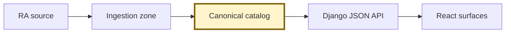
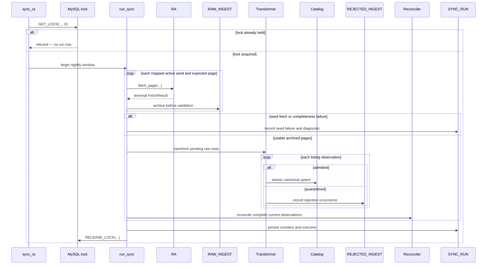
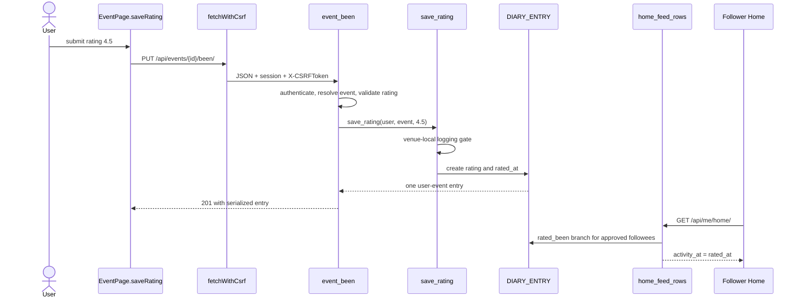

# Danced Data Flow

This reference follows event data from Resident Advisor (RA) acquisition into Danced's canonical catalog—the source-neutral event, venue, artist, and city rows that product code reads. Part 1 describes implemented ingestion behavior; Part 2 describes the product read and social-write paths. Each prose paragraph ends with one compact evidence line; Warnings and Notes retain their citations inline.

## Callout conventions

`> **Warning:**` marks a correctness invariant. Violating it changes stored truth, exposes data incorrectly, or destroys recoverability. Every warning names its enforcement evidence.

`> **Note:**` marks an implemented quirk, a measured baseline, or a deliberate limitation rather than a universal invariant.

## Quick Reference

| Flow | Trigger | Entry point | Section |
|---|---|---|---|
| End-to-end catalog path | Scheduled acquisition or product read | `sync_ra`; `fetchJson` | [System at a Glance](#system-at-a-glance) |
| Nightly synchronization | Scheduler or supervised command | `sync_ra.Command.handle` | [Nightly sync lifecycle](#nightly-sync-lifecycle) |
| Raw response archival | Terminal page-fetch result | `runner._archive_result` | [Raw response archive](#raw-response-archive) |
| Admission and quarantine | Pending `RAW_INGEST` row | `transformer.transform` | [Admission vs. quarantine](#admission-quarantine) |
| Provider identity resolution | Admitted observation | `_resolve_venue`; `_resolve_artist`; `_upsert_event` | [Identity resolution](#identity-resolution) |
| Absence and resurrection | Complete current seed window | `reconciler.reconcile` | [Absence reconciliation](#absence-reconciliation) |
| Firewall | Canonical upsert or product read | `transform`; `_event_queryset` | [The Firewall](#the-firewall) |
| Guest catalog read | `GET /api/events/` or detail request | `catalog.views.event_list`; `event_detail` | [Guest read path](#guest-read-path) |
| Session and privacy boundary | App bootstrap or authenticated request | `session_detail`; named visibility querysets | [Auth boundary](#auth-boundary) |
| Been | Rating form submission | `EventPage.saveRating`; `event_been` | [Worked rating trace](#worked-rating-trace) |
| Home | `GET /api/me/home/` | `users.views.home_feed` | [Feed assembly](#feed-assembly) |
| Activity disappearance | Lifecycle change or source-row mutation | Visibility querysets; removal services | [Disappearance semantics](#disappearance-semantics) |

<a id="system-at-a-glance"></a>

## System at a Glance



The scheduled `sync_ra` command archives and transforms RA listing results into source-neutral `EVENT`, `VENUE`, `ARTIST`, and `CITY` rows. Product endpoints read those canonical rows, and React calls the endpoints with same-origin credentials; neither product layer participates in acquisition.

*Evidence: ingestion/management/commands/sync_ra.py:Command · ingestion/runner.py:run_sync · catalog/views.py:_event_queryset · frontend/src/api.js:fetchJson · ingestion/tests/test_runner.py::RunnerContractTests::test_happy_path_two_pages*

## PART 1 — Acquisition: RA → Canonical Catalog

Acquisition owns provider requests and their recorded outcomes. Admission is the only path from that provider-shaped evidence into the canonical catalog; catalog models themselves contain source-neutral product fields.

*Evidence: ingestion/models.py:RawIngest · ingestion/transformer.py:transform · catalog/models.py:Event · catalog/models.py:Venue · catalog/models.py:Artist · catalog/models.py:City · danced-data-architecture.md § The shape of the system*

<a id="nightly-sync-lifecycle"></a>

### 1.1 Nightly sync lifecycle (lock → paginate → archive → transform → reconcile)

One invocation of `manage.py sync_ra` delegates to `run_sync`. The runner acquires the non-blocking MySQL advisory lock `danced_sync_ra` before it creates a `SYNC_RUN`. If another process holds the lock, the invocation raises `SyncAlreadyRunning` and creates no run row. Once acquired, the lock is released from `finally` after either completion or crash.

*Evidence: ingestion/runner.py:MySqlAdvisoryLock · ingestion/runner.py:run_sync · ingestion/tests/test_runner.py::RunnerContractTests::test_advisory_lock_refuses_second_run*



For each active seed—one tracked provider-area request scope—the runner first requires a `CITY_IDENTITY` mapping. It fetches pages sequentially under one 1,000-attempt run budget; retry attempts consume that same budget. Page one establishes `totalResults`, and the runner derives `expected_pages = max(1, ceil(totalResults / page_size))`. It fetches through that expected page count, archives the terminal `FetchResult` for each page, and only then validates status and envelope metadata.

*Evidence: ingestion/runner.py:_fetch_seed · ingestion/runner.py:_archive_result · ingestion/runner.py:RequestBudget · ingestion/tests/test_runner.py::RunnerContractTests::test_happy_path_two_pages · ingestion/tests/test_client_pacing.py::RaClientPacingTests::test_retry_attempts_consume_shared_request_budget*

Completeness is evaluated after transformation. A seed is complete only when the expected number of archived pages exists, every page returned HTTP 200 and reached `processed`, wrapper coverage equals `totalResults`, and every wrapper has a usable nested `event.id`. Duplicate provider event IDs are valid because coverage is measured at listing-wrapper grain while reconciliation consumes a unique event-ID set.

*Evidence: ingestion/runner.py:_seed_completeness · ingestion/tests/test_completeness_grain.py::WrapperGrainCompletenessTests::test_wrapper_grain_completeness_accepts_duplicate_event_ids · ingestion/tests/test_completeness_grain.py::WrapperGrainCompletenessTests::test_missing_event_id_remains_incomplete_with_numeric_diagnostic*

> **Warning:** Completeness gating—not pagination termination—protects absence reconciliation. A failed page, unusable payload, short wrapper count, or missing nested event ID makes the seed incomplete; its admitted observations may add canonical state, but its omissions cannot increment misses or hide events (`ReconcilerContractTests.test_incomplete_fetch_changes_nothing`, `RunnerContractTests.test_failed_payload_blocks_reconciliation`).

The transformation sweep includes all pending raw rows, including evidence left pending by a crashed earlier run. Those recovered rows may update canonical state and the current run's admission counters, but their observations are not added to a current seed's reconciliation set. Backfill and replay run types also transform without reconciling absence.

*Evidence: ingestion/runner.py:run_sync · ingestion/reconciler.py:reconcile · ingestion/tests/test_runner.py::RunnerContractTests::test_recovery_sweep_transforms_but_never_reconciles · ingestion/tests/test_reconciler.py::ReconcilerContractTests::test_backfill_and_replay_never_reconcile*

At completion, `SYNC_RUN` records seed attempts and failures, admitted observations, quarantine occurrences, drops, timestamps, status, and a joined error summary. A crash marks the run `crashed`; a completed run with a failed seed or zero admitted observations makes the management command exit nonzero.

*Evidence: ingestion/runner.py:run_sync · ingestion/management/commands/sync_ra.py:Command.handle · ingestion/tests/test_runner.py::RunnerContractTests::test_crash_marks_run · ingestion/tests/test_runner.py::RunnerContractTests::test_telemetry_definition · ingestion/tests/test_sync_command_alarm.py::SyncCommandAlarmTests::test_zero_upsert_run_logs_and_exits_nonzero*

<a id="raw-response-archive"></a>

### 1.2 Raw response archive

`RAW_INGEST` records the terminal result of each page fetch before response validation: seed, run, requested date window, page number and size, response body, HTTP status, fetch time, and initial `pending` processing status. A transport failure is still recorded with a null HTTP status and null body; an HTTP error retains its terminal status and body.

*Evidence: ingestion/runner.py:_archive_result · ingestion/models.py:RawIngest · ingestion/tests/test_runner.py::RunnerContractTests::test_transport_failure_seed*

Transformation does not rewrite the archived body. A usable envelope eventually changes `processing_status` from `pending` to `processed`; an unusable envelope changes it to `failed`. The malformed-payload fixture proves that an HTML body received under HTTP 200 remains byte-for-byte present after the failure verdict.

*Evidence: ingestion/transformer.py:transform · ingestion/tests/test_transformer.py::TransformerFixtureContractTests::test_whole_payload_failure*

The archive's parent relationships are deliberately restrictive: `RAW_INGEST.seed_id` and `RAW_INGEST.run_id` use `RESTRICT`, and `REJECTED_INGEST.raw_ingest_id` does the same. Deleting a seed or run therefore cannot cascade through its raw evidence.

*Evidence: ingestion/models.py:RawIngest · ingestion/models.py:RejectedIngest · ERD_REVIEW.md § Accepted implementation deltas*

<a id="admission-quarantine"></a>

### 1.3 Admission vs. quarantine (per-observation, no partial writes)

`transform(raw_ingest_row)` parses the listing envelope once and then evaluates each observation—one event listing wrapper in one payload—independently. It records any usable nested provider event ID as observed before admission, constructs an `EventDTO`, and calls `_admit_event`. A malformed observation can be quarantined while a healthy sibling from the same payload is admitted.

*Evidence: ingestion/transformer.py:transform · ingestion/tests/test_transformer.py::TransformerFixtureContractTests::test_structurally_malformed_event · ingestion/tests/test_transformer.py::TransformerFixtureContractTests::test_missing_event_id*

Each `_admit_event` call has its own database transaction. Venue resolution, artist resolution, event and identity upsert, and lineup replacement either commit together or roll back together. The rejection occurrence is written afterward in a separate transaction, keyed by `(raw_ingest_id, entity_index)` through `uq_rejection_payload_index`.

*Evidence: ingestion/transformer.py:_admit_event · ingestion/transformer.py:_record_rejection · ingestion/models.py:RejectedIngest · ingestion/models.py:RejectedIngest.Meta.constraints[uq_rejection_payload_index]*

> **Warning:** A quarantined observation must leave no partial canonical graph. The TBA-lineup contract resolves a venue inside the transaction, rejects on `NO_ARTIST`, and proves that zero venue, artist, event, lineup, or identity rows survive (`TransformerFixtureContractTests.test_tba_lineup`; transaction boundary: `ingestion.transformer._admit_event`).

This read-only sample is an actual rejection from the latest inspected nightly run. It links page-one raw evidence to observation index 11 without retaining any partial canonical graph:

*Evidence: `RejectedIngest.objects.filter(raw_ingest__run_id=9, reason="NO_ARTIST").select_related("raw_ingest", "raw_ingest__seed").order_by("id").first()`*

```json
{
  "id": 2446,
  "raw_ingest_id": 332,
  "run_id": 9,
  "seed": "ra:8",
  "page_number": 1,
  "entity_index": 11,
  "entity_ref": "2501224",
  "reason": "NO_ARTIST",
  "detail": null,
  "raw_http_status": 200,
  "raw_processing_status": "processed",
  "rejected_at": "2026-07-31T20:01:24.944145+00:00"
}
```

> **Note:** The latest inspected nightly run was run 9, not a permanent operating ratio. It produced 816 observation outcomes: 498 admitted, 318 quarantined, and 0 dropped. Thus 318/816 observations—38.97%, approximately 39%—were quarantined; all 318 quarantine rows were `NO_ARTIST`. A later observation with a populated artist list retries normally and can admit the event without manual cleanup (`RejectedIngest.objects.filter(raw_ingest__run_id=9).values("reason").annotate(count=Count("id"))`; `TransformerCrossCuttingContractTests.test_quarantine_retry`).

<a id="identity-resolution"></a>

### 1.4 Identity resolution and provider-identity tables

Four concrete mapping tables isolate provider identity from canonical identity: `CITY_IDENTITY`, `VENUE_IDENTITY`, `ARTIST_IDENTITY`, and `EVENT_IDENTITY`. Each uses `(source, source_id)` to locate its canonical row. Canonical `CITY`, `VENUE`, `ARTIST`, and `EVENT` rows do not carry RA IDs.

*Evidence: catalog/models.py:CityIdentity · catalog/models.py:VenueIdentity · catalog/models.py:ArtistIdentity · catalog/models.py:EventIdentity · ERD_REVIEW.md § Ingestion → canonical*

City resolution occurs at seed grain. Before fetching, `run_sync` resolves `(seed.source, seed.area_ref)` through `CITY_IDENTITY`; a missing mapping fails that seed before any request and does not become event-level quarantine.

*Evidence: ingestion/runner.py:run_sync · ingestion/tests/test_runner.py::RunnerContractTests::test_unmapped_seed_refused_before_fetch · catalog/tests/test_models.py::CatalogSchemaTests::test_v1_city_identities_resolve_ra_seed_areas*

For venues and artists, an identity hit reuses and updates the mapped canonical row; a miss creates the canonical row and identity in the same observation transaction. Event resolution follows the same seam. An `EVENT_IDENTITY` hit updates the existing event in place, resets that identity's misses, and replaces lineup join rows atomically only when their ordered content changed.

*Evidence: ingestion/transformer.py:_resolve_venue · ingestion/transformer.py:_resolve_artist · ingestion/transformer.py:_upsert_event · ingestion/tests/test_transformer.py::TransformerCrossCuttingContractTests::test_changed_event_upsert_in_place · ingestion/tests/test_idempotency.py::TransformerIdempotencyTests::test_lineup_reorder*

Provider display names are mutable attributes, not identity keys. Artists are deliberately non-unique by name, and repeated payloads resolve through provider IDs rather than name matching. Processing the same fixtures twice, including pagination and lineup reordering, produces the same canonical state.

*Evidence: catalog/models.py:Artist · catalog/models.py:ArtistIdentity · danced.dbml anchor “Table ARTIST” · danced.dbml anchor “Table ARTIST_IDENTITY” · ingestion/tests/test_idempotency.py::TransformerIdempotencyTests::test_double_transform_all_fixtures · ingestion/tests/test_idempotency.py::TransformerIdempotencyTests::test_double_transform_after_pagination · ingestion/tests/test_idempotency.py::TransformerIdempotencyTests::test_lineup_reorder_is_idempotent*

<a id="absence-reconciliation"></a>

### 1.5 Absence reconciliation and resurrection

Reconciliation operates at the provider-identity testimony grain. For a complete, non-backfill, non-replay seed window, `reconcile` locks future in-window `EVENT_IDENTITY` rows for that source and canonical city. An observed source ID resets `misses` to zero; an omitted ID increments it. Past events and events outside the covered window are untouched.

*Evidence: ingestion/reconciler.py:reconcile · ingestion/tests/test_reconciler.py::ReconcilerContractTests::test_past_events_untouched · ingestion/tests/test_reconciler.py::ReconcilerContractTests::test_scope_is_per_seed_window*

Listed IDs are observations even when admission fails. Because `transform` collects `event.id` before `_admit_event`, an existing mapped event that is listed but currently quarantined resets its miss counter instead of being treated as absent.

*Evidence: ingestion/transformer.py:transform · ingestion/runner.py:run_sync · ingestion/tests/test_reconciler.py::ReconcilerContractTests::test_quarantined_but_listed_resets*

After identity counters change, `_derived_status` evaluates all identities for the canonical event. All identities at one or more misses yield `unverified`; all at three or more yield `hidden`; any identity still at zero keeps the event `active`. A later observed presence resets its identity and restores the canonical event to `active`.

*Evidence: ingestion/reconciler.py:_derived_status · ingestion/reconciler.py:reconcile · ingestion/tests/test_reconciler.py::ReconcilerContractTests::test_absence_ladder · ingestion/tests/test_reconciler.py::ReconcilerContractTests::test_presence_resets · ingestion/tests/test_reconciler.py::ReconcilerContractTests::test_resurrection_from_hidden*

> **Warning:** Incomplete data may add but never subtract. Admission commits valid observations before completeness is known, but an incomplete seed cannot increment any absence counter or change lifecycle status (`ReconcilerContractTests.test_incomplete_fetch_changes_nothing`; `WrapperGrainCompletenessTests.test_missing_event_id_remains_incomplete_with_numeric_diagnostic`).

> **Warning:** The ingestion pipeline never deletes user history. Absence reconciliation changes `EVENT.status`; it does not delete `EVENT`, `DIARY_ENTRY`, `WILL_BE_THERE`, review, like, or favorite rows. Hidden events disappear from normal product projections, and resurrection exposes the preserved relationships again (`BeenApiContractTests.test_hidden_entries_are_suppressed_from_both_paths_then_resurrect`, `WillBeThereApiContractTests.test_hidden_event_suppresses_without_deleting_and_resurrection_restores`, `HomeFeedContractTests.test_hidden_items_are_suppressed_and_resurrection_restores_them`).

<a id="the-firewall"></a>

## THE FIREWALL

At the Firewall, only canonical `CITY`, `VENUE`, `ARTIST`, `EVENT`, and `EVENT_ARTIST` rows cross from asynchronous acquisition into synchronous product behavior. Catalog endpoints read those models, and user records refer to canonical IDs through approved foreign keys such as `DIARY_ENTRY.event_id`, `WILL_BE_THERE.event_id`, and favorite target IDs.

*Evidence: catalog/views.py:_event_queryset · catalog/views.py:event_detail · users/models.py:DiaryEntry · users/models.py:WillBeThere · users/models.py:FavoriteEvent · users/models.py:FavoriteArtist · users/models.py:FavoriteVenue · ERD_REVIEW.md § App → canonical*

Provider identity does not cross. `EVENT_IDENTITY`, `VENUE_IDENTITY`, `ARTIST_IDENTITY`, and `CITY_IDENTITY` point from `(source, source_id)` to canonical rows, but no ingestion table has a canonical foreign key and no application table refers to ingestion or identity tables. The Transformer is the sole code bridge between the zones.

*Evidence: catalog/models.py:EventIdentity · catalog/models.py:VenueIdentity · catalog/models.py:ArtistIdentity · catalog/models.py:CityIdentity · ERD_REVIEW.md § Ingestion → canonical*

City assignment demonstrates the seam concretely. A tracked source page carries provider area identity. Before acquisition, `run_sync` resolves `(seed.source, seed.area_ref)` through `CITY_IDENTITY`; `_admit_event` then writes the resulting canonical `CITY` relationship through `VENUE.city_id`. Product reads receive that canonical city and its timezone, never the seed or provider area reference.

*Evidence: ingestion/runner.py:run_sync · ingestion/transformer.py:_admit_event · catalog/views.py:_serialize_event · ingestion/tests/test_runner.py::RunnerContractTests::test_unmapped_seed_refused_before_fetch · catalog/tests/test_models.py::CatalogSchemaTests::test_v1_city_identities_resolve_ra_seed_areas*

Provider availability and latency also stop at the Firewall. The RA client is invoked by the `sync_ra` management command through `run_sync`; product API routes dispatch only catalog and user views. If acquisition stops succeeding, existing canonical and user rows remain readable while catalog growth pauses.

*Evidence: ingestion/management/commands/sync_ra.py:Command · ingestion/runner.py:run_sync · config/urls.py:urlpatterns · danced-data-architecture.md § No acquisition in the user request path*

> **Warning:** Never fetch RA on demand from search, an event page, or another user request. That would place an unofficial endpoint in the synchronous path, couple product latency to RA response time and rate limits, and turn provider blocking from a stale catalog into a user-facing failure. Acquisition must remain behind the asynchronous canonical boundary (`danced-data-architecture.md § No acquisition in the user request path`).

## PART 2 — Product: Canonical Catalog → User

Product requests begin with canonical catalog rows and add viewer-specific user projections through named visibility boundaries. Neither catalog detail nor Home imports or queries ingestion models.

*Evidence: catalog/views.py:event_detail · users/views.py:home_feed · catalog/tests/test_api.py::CatalogApiTests::test_response_contract_does_not_expose_lifecycle_status*

<a id="guest-read-path"></a>

### 2.1 Guest read path (venue-local date classification, deterministic pagination)

Guests call the same city, venue, artist, and event endpoints as authenticated viewers. `_event_queryset` exposes `active` and `unverified` events and suppresses `hidden` events; serializers never include the internal lifecycle field. An unknown or hidden event detail resolves to the same 404 surface.

*Evidence: catalog/views.py:VISIBLE_EVENT_STATUSES · catalog/views.py:_event_queryset · catalog/views.py:event_detail · catalog/tests/test_api.py::CatalogApiTests::test_filters_by_city_and_public_lifecycle_visibility · catalog/tests/test_api.py::CatalogApiTests::test_hidden_event_detail_is_not_found · catalog/tests/test_api.py::CatalogApiTests::test_response_contract_does_not_expose_lifecycle_status*

Upcoming and past are venue-local classifications over stored local dates. `_date_filter` computes today separately in every participating city's IANA timezone: upcoming means `event_date >= local_today`, and past means `event_date < local_today`. An artist page spanning cities can therefore classify two same-date events differently at the same UTC instant.

*Evidence: catalog/views.py:_date_filter · catalog/tests/test_api.py::CatalogApiTests::test_today_is_upcoming_until_venue_local_midnight · catalog/tests/test_api.py::CatalogApiTests::test_artist_scope_classifies_each_event_in_its_venue_timezone*

Pagination is deterministic within each requested scope. Upcoming results use `(event_date ASC, id ASC)`; past results use `(event_date DESC, id DESC)`. `Paginator` returns explicit counts and adjacent page numbers, while a page beyond the last page returns 404.

*Evidence: catalog/views.py:event_list · catalog/tests/test_api.py::CatalogApiTests::test_orders_by_event_date_then_canonical_id · catalog/tests/test_api.py::CatalogApiTests::test_paginates_full_and_partial_pages_without_overlap · catalog/tests/test_api.py::CatalogApiTests::test_past_excludes_today_and_orders_date_then_id_descending · catalog/tests/test_api.py::CatalogApiTests::test_page_beyond_last_page_is_not_found*

<a id="auth-boundary"></a>

### 2.2 Auth boundary (session bootstrap, CSRF rotation, privacy gate)

`GET /api/auth/session/` is the browser bootstrap. `session_detail`, decorated with `ensure_csrf_cookie`, returns `{authenticated: false, user: null}` for a guest or the authenticated user's self-only identity shape. Email appears only in this self serializer.

*Evidence: users/views.py:session_detail · users/views.py:_user_payload · users/tests/test_auth_api.py::AuthApiContractTests::test_session_bootstrap_sets_csrf_cookie_and_reports_guest · users/tests/test_auth_api.py::AuthApiContractTests::test_registration_signs_in_and_returns_self_only_user_shape*

`fetchWithCsrf` obtains the bootstrap cookie when it is missing, copies `csrftoken` into `X-CSRFToken`, and delegates to `fetchJson`, which always uses same-origin credentials. Registration and login call Django's `login`, which establishes the session and rotates the CSRF secret; logout invalidates the session and remains idempotent.

*Evidence: frontend/src/api.js:fetchWithCsrf · frontend/src/api.js:fetchJson · users/views.py:register · users/views.py:login_view · users/views.py:logout_view · users/tests/test_auth_api.py::AuthApiContractTests::test_registration_requires_csrf · users/tests/test_auth_api.py::AuthApiContractTests::test_login_persists_session_across_requests · users/tests/test_auth_api.py::AuthApiContractTests::test_logout_invalidates_session_and_is_idempotent*

Authentication establishes who the viewer is; named querysets decide what that viewer may attribute to another user. Will Be There (WBT) is a user's intention to attend an event before its venue-local calendar expiry. Profile, diary, review, and WBT reads allow public content, the owner's own content, or private content reached through an approved follow; anonymous aggregate querysets are separate and do not expose contributor identity.

*Evidence: users/models.py:DancedUserManager.profile_content_visible_to · users/models.py:DiaryEntryQuerySet.visible_to · users/models.py:ReviewQuerySet.visible_to · users/models.py:WillBeThereQuerySet.visible_to · users/models.py:DiaryEntryQuerySet.for_aggregation · users/tests/test_profile_api.py::ProfileApiContractTests::test_approved_follower_sees_private_been_and_review_through_sanctioned_boundaries*

> **Warning:** Never replace a named privacy boundary with an unscoped model query in an attributed response. Private-profile content must be absent or forbidden for an unauthorized viewer, not serialized and filtered after evaluation (`ProfileApiContractTests.test_private_stub_has_only_identity_and_no_restricted_or_email_fields`, `ProfileApiContractTests.test_private_content_is_403_not_empty_while_authorized_empty_is_200`).

<a id="worked-rating-trace"></a>

### 2.3 Worked trace: one rating, from click to row to feed appearance



1. The trace starts when an authenticated user selects `4.5` on an event whose venue-local start boundary has passed. `EventPage.saveRating` converts the selected string to a number and calls `mutate` with `PUT /api/events/{eventId}/been/` and `{"rating": 4.5}`; `mutate` sends the request through `fetchWithCsrf`.

   *Evidence: frontend/src/pages/EventPage.jsx:EventPage · frontend/src/pages/EventPage.jsx:EventPage.saveRating · frontend/src/pages/EventPage.jsx:EventPage.mutate · frontend/src/api.js:fetchWithCsrf · users/services.py:event_is_loggable · users/tests/test_been_api.py::BeenApiContractTests::test_start_time_gate_rejects_before_and_accepts_at_boundary*

2. `users.been_urls.urlpatterns` dispatches the resource to `users.views.event_been`. The view requires authentication, resolves only a publicly visible canonical event through `_visible_event`, and accepts only configured half-star values through `_rating_from_payload`.

   *Evidence: users/been_urls.py:urlpatterns[event-been] · users/views.py:event_been · users/views.py:_visible_event · users/views.py:_rating_from_payload · users/tests/test_been_api.py::BeenApiContractTests::test_rating_rejects_every_out_of_contract_value*

3. `event_been` calls `users.services.save_rating`. The service locks the acting user, looks for the viewer's existing entry, computes the event boundary in `event.venue.city.timezone`, and rejects a first log before the scheduled local wall time. A missing start time opens at local midnight.

   *Evidence: users/services.py:save_rating · users/services.py:event_is_loggable · users/tests/test_been_api.py::BeenApiContractTests::test_start_time_gate_rejects_before_and_accepts_at_boundary · users/tests/test_been_api.py::BeenApiContractTests::test_null_start_time_opens_at_venue_local_midnight*

4. For a first rating, `save_rating` inserts one `DIARY_ENTRY` with `user_id`, `event_id`, `rating=4.5`, a new `rated_at`, and database-generated `created_at`. `uq_diary_user_event` prevents a second row; `ck_diary_rating_half_star` and `ck_diary_rating_rated_at` enforce the stored rating domain and rating/timestamp biconditional. An edit changes `rating` but preserves the existing `rated_at`.

   *Evidence: users/models.py:DiaryEntry · users/services.py:save_rating · users/tests/test_been_api.py::BeenApiContractTests::test_one_entry_per_user_event_and_edit_preserves_rated_at · users/tests/test_been_api.py::BeenApiContractTests::test_database_rejects_rating_timestamp_mismatches_and_invalid_values*

5. `event_been` serializes the entry and returns 201 for creation or 200 for an update. `EventPage.mutate` refetches the event projection after success.

   *Evidence: users/views.py:event_been · users/services.py:serialize_diary_entry · frontend/src/pages/EventPage.jsx:EventPage.mutate*

6. No feed row is written. On a follower's next Home request, `home_feed_rows` builds the `rated_been` branch from visible `DIARY_ENTRY` rows belonging to approved followees, requiring both `rating` and `rated_at`. It emits `activity_at = rated_at` and a fixed-width source key derived from the entry ID. A private actor appears only while the viewer remains an approved follower.

   *Evidence: users/home_feed.py:home_feed_rows[rated_been] · users/models.py:DiaryEntryQuerySet.visible_to · users/tests/test_home_api.py::HomeFeedContractTests::test_private_actor_activity_disappears_immediately_on_unfollow · users/tests/test_home_api.py::HomeFeedContractTests::test_rating_removal_disappears_and_rerating_repositions*

<a id="feed-assembly"></a>

### 2.4 Feed assembly (query-time UNION ALL, frozen cursor key, per-branch visibility)

Home has six source branches: `will_be_there`, `review_like`, `rated_been`, `follow`, `favorite_event`, and `favorite_artist`. Each branch annotates the same `FEED_FIELDS` projection, and Django combines them with `union(..., all=True)` before ordering and limiting. The mixed six-type contract observes one SQL `UNION ALL`; there is no feed model, feed table, or fan-out write.

*Evidence: users/home_feed.py:ACTIVITY_TYPES · users/home_feed.py:FEED_FIELDS · users/home_feed.py:home_feed_rows · users/tests/test_home_api.py::HomeFeedContractTests::test_six_type_identical_timestamp_order_and_source_key_tiebreak_are_fixed · ERD_REVIEW.md § 1. User rates an event · PRODUCT_QA_SPEC.md § Amendment to Questions 102, 153, 178, and 189–190*

The frozen descending cursor key is `(activity_at, activity_type, source_key)`. `encode_cursor` serializes that triple; `decode_cursor` rejects unknown types, malformed timestamps, and source keys outside the fixed-width format. `_after_cursor` distributes the lexicographic “older than” predicate into every source branch before union, so activity arriving after page one cannot shift the continuation boundary.

*Evidence: users/home_feed.py:encode_cursor · users/home_feed.py:decode_cursor · users/home_feed.py:_after_cursor · users/home_feed.py:home_feed_rows · users/tests/test_home_api.py::HomeFeedContractTests::test_cursor_is_stable_when_new_activity_arrives · users/tests/test_home_api.py::HomeFeedContractTests::test_six_type_identical_timestamp_order_and_source_key_tiebreak_are_fixed*

> **Warning:** Visibility must be enforced inside every union branch, before pagination. `rated_been` uses `DiaryEntry.visible_to`; review likes require a review from `Review.visible_to`; Will Be There uses `WillBeThere.visible_to`; event favorites filter visible lifecycle state; and every branch is restricted to approved followees. Filtering only after the union could leak private rows or underfill pages (`HomeFeedContractTests.test_private_actor_activity_disappears_immediately_on_unfollow`, `HomeFeedContractTests.test_review_like_never_leaks_an_invisible_private_review`, `HomeFeedContractTests.test_hidden_items_are_suppressed_and_resurrection_restores_them`).

> **Note:** Home is a live projection, not an activity ledger. The six source tables own their timestamps and visibility; adding a feed type means adding another branch with the same fields, cursor predicate, and in-branch privacy enforcement (`PRODUCT_QA_SPEC.md § Amendment to Questions 102, 153, 178, and 189–190`).

<a id="disappearance-semantics"></a>

### 2.5 Disappearance semantics (hidden events, cascades, feed items vanishing via source-row deletion)

Hidden lifecycle state suppresses event-backed diary entries, reviews, Will Be There marks, event favorites, statistics, and Home items at query time. The underlying user rows remain. Restoring the event to `active` makes those relationships visible again without reconstructing them.

*Evidence: users/models.py:DiaryEntryQuerySet.visible_to · users/models.py:ReviewQuerySet.visible_to · users/models.py:WillBeThereQuerySet.active_at · users/views.py:profile_favorites · users/views.py:profile_stats · users/home_feed.py:home_feed_rows · users/tests/test_home_api.py::HomeFeedContractTests::test_hidden_items_are_suppressed_and_resurrection_restores_them · users/tests/test_favorites_api.py::FavoritesContractTests::test_hidden_event_suppresses_favorite_and_stats_then_resurrects*

Source-row changes drive other disappearance. Rating removal clears `rating` and `rated_at`; WBT removal, unlike, unfollow, and unfavorite delete their source rows. Because Home is rebuilt from those sources, the associated item vanishes without deleting a feed copy. Re-rating an unrated Been entry assigns a new `rated_at`, creating new feed activity at the new position.

*Evidence: users/services.py:remove_rating · users/services.py:remove_will_be_there · users/services.py:unlike_review · users/services.py:unfollow_user · users/services.py:remove_favorite · users/home_feed.py:home_feed_rows · users/tests/test_home_api.py::HomeFeedContractTests::test_rating_removal_disappears_and_rerating_repositions · users/tests/test_will_be_there_api.py::WillBeThereApiContractTests::test_unmark_is_idempotent_and_removes_feed_item*

Anonymous totals are deliberately separate from attribution. `DiaryEntry.for_aggregation` includes valid ratings from private users while returning no identity, implementing the rule that private users' ratings still contribute to the global average (Q32). The active WBT count likewise uses `WillBeThere.active_at` without applying attendee-list privacy: Public means attributed attendees from public accounts, while Your Circle means followed users visible to the viewer. Anonymous counts must not be derived from either attributed list's total (Q93). Both aggregate paths still suppress hidden events.

*Evidence: users/models.py:DiaryEntryQuerySet.for_aggregation · users/models.py:WillBeThereQuerySet.active_at · catalog/views.py:event_detail · PRODUCT_QA_SPEC.md § Question 32 · PRODUCT_QA_SPEC.md § Amendment to Questions 93 and 196–198 · users/tests/test_been_api.py::BeenApiContractTests::test_owner_only_diary_and_private_rating_stays_anonymous · users/tests/test_favorites_api.py::FavoritesContractTests::test_event_detail_wbt_count_is_anonymous_inclusive_and_active_only*

Physical MySQL behavior is explicit where ORM declarations are insufficient. Django's `on_delete=CASCADE` invokes its ORM collector but does not itself emit MySQL `ON DELETE CASCADE`; migrations replace the generated user-owned diary, review, like, WBT, favorite, follow, and notification keys with physical cascades. Canonical event relationships from diary, WBT, and favorite intent remain restrictive, so a direct event deletion cannot erase user history.

*Evidence: users/migrations/0004_enforce_diary_user_cascade.py:enforce_user_cascade · users/migrations/0006_enforce_review_database_cascades.py:enforce_cascades · users/migrations/0008_enforce_social_database_cascades.py:enforce_cascades · users/migrations/0010_enforce_wbt_user_cascade.py:enforce_cascade · users/migrations/0013_enforce_favorite_user_cascades.py:forwards · ERD_REVIEW.md § Accepted implementation deltas · users/tests/test_will_be_there_api.py::WillBeThereApiContractTests::test_user_delete_cascades_and_event_delete_is_restricted*

Deleting a review is a narrower cascade: `REVIEW_LIKE` and review-linked notifications are physically dependent on the review, while the parent `DIARY_ENTRY` and its rating remain. Removing a rating deliberately deletes its review first and then clears the rating fields, preserving the unrated Been row.

*Evidence: users/services.py:delete_review · users/services.py:remove_rating · users/migrations/0006_enforce_review_database_cascades.py:enforce_cascades · users/tests/test_review_api.py::ReviewApiContractTests::test_review_only_delete_spares_rating_and_cascades_likes · users/tests/test_review_api.py::ReviewApiContractTests::test_rating_removal_reports_and_performs_review_cascade*
