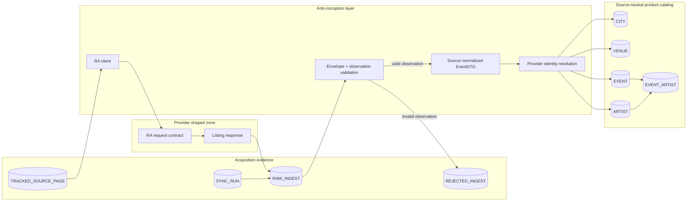
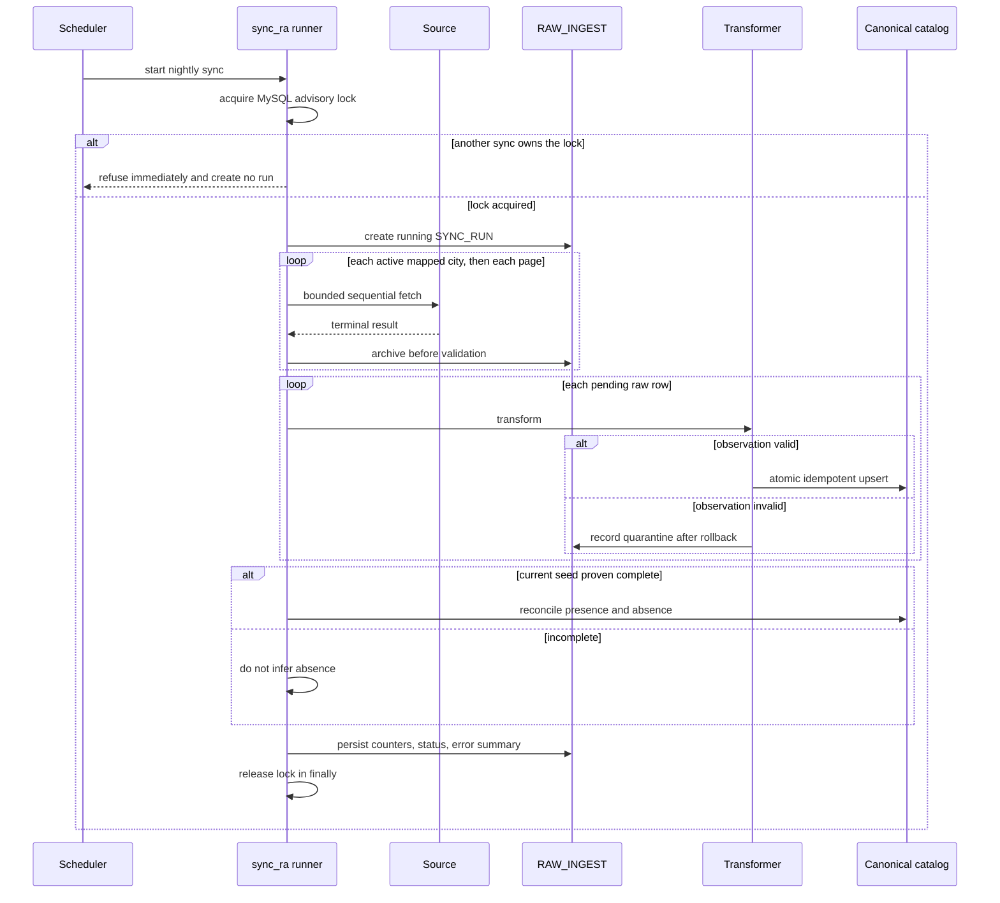
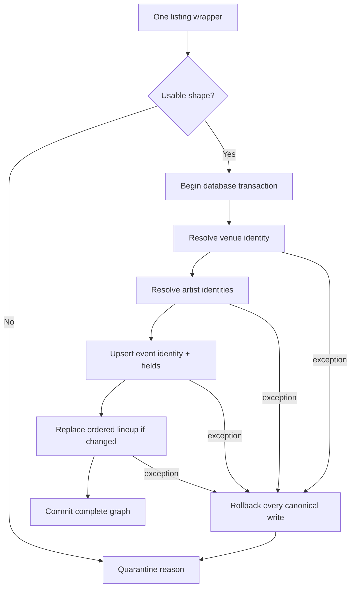
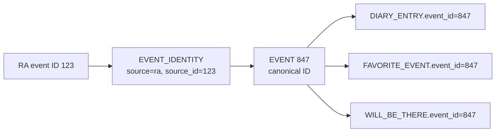
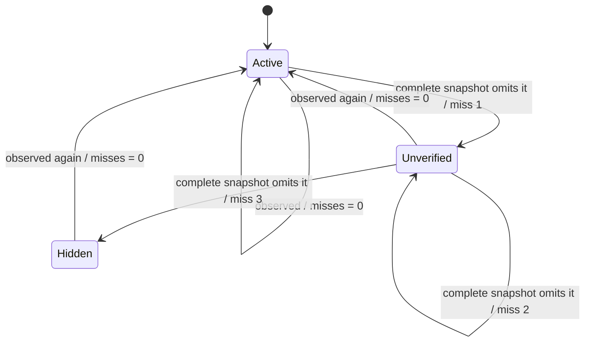
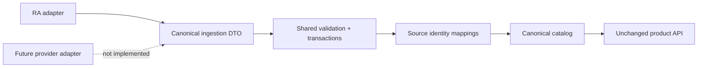

# Event ingestion: from external observations to trusted catalog state

This is the part of Onda where uncertainty is handled. It explains the implemented path from a provider response to a canonical event, including the conditions under which Onda refuses to change existing truth.

## Why this pipeline exists

Onda borrows the useful shape of social diaries such as Beli and Letterboxd: the object being discussed needs a stable catalog identity before users can rate it, review it, or share it. The live-music domain has a different data constraint. [Letterboxd documents that TMDB supplies its film metadata](https://letterboxd.com/about/film-data/); I did not find an equivalent source that was simultaneously centralized, authoritative, complete, and suitable for Onda's event needs.

Resident Advisor was the closest source I found for the first version. Its listings still have the properties that make direct product coupling unsafe:

- events change or disappear;
- pagination can be partial;
- provider IDs belong to the provider, not to Onda;
- individual records can be incomplete even when the page request succeeds;
- the endpoint is an observed web contract, not an Onda-owned API contract;
- a future source may describe the same city, venue, artist, or event differently.

The resulting architecture is best described as an **anti-corruption layer with a source-neutral canonical model**. The adapter absorbs provider-specific structure. Identity tables translate provider IDs. Only validated canonical entities cross into product code.

Onda is not itself a distributed service topology, but acquisition crosses a real distributed boundary that Onda does not control. The timeout, retry, idempotency, partial-failure, concurrency, and reconciliation rules below are the measures used to keep that boundary from corrupting local state.

That wording is intentionally narrower than “source-independent”:

| Statement | True today? | Meaning |
|---|---:|---|
| Product tables do not contain RA IDs | Yes | Provider identity terminates at mapping tables. |
| Product requests parse RA payloads | No | Ingestion is outside the synchronous request path. |
| A new provider can target the same canonical model | Yes, by design | The seam exists and is tested through current contracts. |
| A second provider adapter exists | No | v1 has one implemented source. |
| Coverage survives the loss of RA today | No | Existing data remains readable, but catalog updates stop. |
| Replacing the source is configuration-only | No | It requires an adapter and real entity-mapping work. |

## The trust boundary

The Transformer is the only code bridge between provider-shaped evidence and canonical state. Application tables refer to canonical IDs; they never refer to `RAW_INGEST`, a tracked provider page, or an RA identifier.

## One synchronization run

The scheduled entry point is the Django management command `manage.py sync_ra`. In production it runs nightly. The command delegates all acquisition decisions to the runner and exits nonzero when the run crashes, any configured city seed fails, or the run admits zero observations.

### Acquisition controls

| Control | Implemented behavior | Why it exists |
|---|---|---|
| Mutual exclusion | Non-blocking MySQL advisory lock `onda_sync_ra` | Two schedulers cannot race canonical updates or absence counters. |
| Scope | Each active tracked page must map to a canonical city before any request | Unknown provider areas cannot silently create cities. |
| Window | Nightly default runs from the runner's current date through 30 days ahead | Work and reconciliation scope are explicit. |
| Pagination | Page size 20; pages fetched sequentially | Avoids burst concurrency and makes coverage accounting deterministic. |
| Pacing | 1.5 seconds between page fetches | Bounds request frequency at the adapter. |
| Timeout | 20 seconds per attempt | A stalled source cannot hang the run indefinitely. |
| Retry ceiling | At most 3 attempts | Transient recovery remains finite. |
| Retry statuses | 408, 429, 500, 502, 503, 504 | Only expected transient classes retry. |
| Backoff | Honors `Retry-After`; otherwise full jitter from zero to an exponential ceiling (1 second after attempt 1, 2 seconds after attempt 2; implementation cap 8 seconds) | Responds to throttling without synchronized retry bursts. |
| Run budget | 1,000 request attempts, including retries | A pagination anomaly cannot produce unbounded traffic. |
| Network boundary | One fixed HTTPS endpoint; redirects must retain the exact origin | The adapter cannot be redirected to another host or a cloud metadata address. |
| Response ceiling | 2 MiB per response | A malfunctioning source cannot force an unbounded in-memory read. |
| Archive budget | 100 MiB of encoded response bodies per run | A run stops before an anomalous source can fill database storage. |

The v1 adapter calls a publicly reachable, unauthenticated Resident Advisor GraphQL listing endpoint using a captured request shape. It uses no account credentials, cookies, CAPTCHA bypass, challenge circumvention, or per-user requests.

## Evidence is stored before it is judged

For every response inside those safety ceilings, the runner creates `RAW_INGEST` from the **terminal fetch result before payload validation**. It records:

- the tracked source page and sync run;
- requested date window, page number, and page size;
- response body and HTTP status when available;
- fetch time;
- processing status: `pending`, `processed`, or `failed`.

A transport failure is evidence too: it is archived with a null status/body. A malformed HTML body returned under HTTP 200 stays intact when processing marks the row failed. An over-limit body is deliberately not retained; the run records the named ceiling failure instead. This makes ordinary acquisition replayable without allowing evidence storage itself to become unbounded, and separates “what was received” from “what Onda concluded.”

The raw evidence relationships use restrictive deletion behavior. A run or seed cannot be casually deleted through a cascade that also erases the response history.

## One bad observation does not poison its page

After the listing envelope is parsed, each listing wrapper is handled independently:

1. Record a usable provider event ID as **observed**, even before admission.
2. Validate required title, date, venue, artist, and provider identity fields.
3. Normalize the source object into an internal `EventDTO`.
4. Open a transaction for that observation.
5. Resolve or create the canonical venue, artists, event, identity mappings, and ordered lineup.
6. Commit the complete graph, or roll it all back.
7. After rollback, write one `REJECTED_INGEST` occurrence with the raw row, wrapper index, provider reference when available, and a reason.

Implemented quarantine reasons are `NO_ARTIST`, `EMPTY_TITLE`, `BAD_DATE`, `PARSE_FAILURE`, and a reserved `OUT_OF_SCOPE` category. Quarantine is strict: the transformer does not invent an artist, repair a date, or admit a partial event to improve coverage numbers.

The unique key `(raw_ingest_id, entity_index)` makes rejection recording idempotent when a pending row is recovered after an interrupted run.

## Idempotency and the identity firewall

Onda maintains four mappings:

| Mapping | Provider key resolves to |
|---|---|
| `CITY_IDENTITY` | canonical `CITY` |
| `VENUE_IDENTITY` | canonical `VENUE` |
| `ARTIST_IDENTITY` | canonical `ARTIST` |
| `EVENT_IDENTITY` | canonical `EVENT` |

Each provider identity is unique on `(source, source_id)`, and each canonical record can have at most one identity for a given source. Display names are mutable attributes, not identity keys: two artists may share a name, and a venue rename does not create a second venue when its provider identity is stable.

Reprocessing the same provider ID updates the mapped canonical row in place. Event lineup rows are replaced atomically only when their ordered content changes. Contract tests process fixtures repeatedly—including pagination and lineup reordering—and assert stable canonical state.

If a future adapter observes the same real event, it needs an explicit entity-resolution decision before a second identity can point to event 847. The schema supports that result; it does not pretend the difficult matching decision is automatic.

## Completeness is a safety condition

Fetching “the last page” is not enough evidence that a source window is complete. Onda evaluates completeness after transformation. A city seed is complete only when all of the following are true:

- the expected number of archived pages exists;
- every page's terminal response is HTTP 200;
- every raw page reached `processed` rather than `failed`;
- the number of listing wrappers equals the source's `totalResults` value;
- every wrapper contains a usable nested provider event ID.

Duplicate event IDs are allowed. Completeness is measured at **listing-wrapper grain** because the provider can return more than one wrapper for the same event; reconciliation later consumes the unique ID set.

> **Safety rule:** incomplete data may add valid observations, but it may never subtract existing catalog truth.

This asymmetry matters. A good event on page one can still be admitted when page two fails. But because the overall snapshot is incomplete, an event missing from the fetched subset cannot accumulate a miss.

## Absence is suspicion, not deletion

Only a complete **nightly** seed window can reconcile absence. Backfill and replay runs transform data without changing absence counters.

For future events inside that city, source, and date window:

- an observed provider identity resets `misses` to zero;
- an omitted identity increments `misses` by one;
- any identity at zero keeps the canonical event `active`;
- all identities at one or more misses make it `unverified`;
- all identities at three or more misses make it `hidden`.

With multiple provider identities, the status is derived collectively: one currently observed source can keep the event active. The current implementation has one source, but the rule does not hard-code that assumption.

Reconciliation never deletes the event or user history. A hidden event is suppressed by catalog and social queries. Its Been entries, reviews, likes, plans, and favorites remain stored, and they become visible again if the event is observed later.

The captured RA contract has no structured cancellation field. Onda does not guess cancellation from title text; cancellation-like disappearance follows the same repeated-absence rule.

## Failure behavior is explicit

| Failure | Preserved | Blocked |
|---|---|---|
| Advisory lock already held | Existing run and catalog state | Second run; no duplicate `SYNC_RUN` row |
| Transport/HTTP failure | Terminal fetch evidence and run diagnostics | Completeness and absence reconciliation |
| Response or archive ceiling reached | Existing evidence and run diagnostics | Oversized body retention, completeness, and absence reconciliation |
| Whole payload malformed | Exact archived response body | Every observation on that page |
| One event malformed | Valid siblings and a rejection record | Partial writes for that event only |
| Missing provider event ID | Wrapper count and rejection evidence | Completeness for the seed |
| Run crash | Previously committed per-observation work and raw evidence | Run marked `crashed`; command returns failure |
| Incomplete seed | Any valid additions already admitted | Miss increments and hiding |
| Source unavailable over time | Existing canonical catalog and all user data | New coverage and updates |

`SYNC_RUN` records start/finish times, run type, status, seeds attempted/failed, admitted observations, quarantined observations, drops, and an error summary. These counters describe pipeline outcomes; “admitted” is not synonymous with “new unique event,” because a repeated observation can update an existing canonical row.

## How a new source would be added

The intentional extension seam is before the canonical DTO and identity resolver:

A real replacement or additional source would require:

1. permission and contract review for that source;
2. a bounded client with captured, sanitized fixtures;
3. response-to-DTO mapping and provider-specific validation;
4. tracked-page/city mappings;
5. entity resolution for overlap with existing cities, venues, artists, and events;
6. completeness semantics appropriate to that provider;
7. contract, idempotency, failure, and reconciliation tests;
8. a controlled backfill and comparison before changing coverage responsibility.

The React application, user tables, and most catalog endpoints should not need provider-shaped changes. That is the architectural protection. The adapter and entity-resolution work remain real engineering work.

## Verification and production evidence

As verified on **August 20, 2026**:

- 13 synthetic JSON contracts exercise the ingestion boundary;
- the full 262-test Django suite passed against MySQL;
- production scheduled the sync once per night under a host-level `flock`, in addition to the MySQL advisory lock;
- the most recent completed run inspected was a two-city backfill with 2/2 seeds successful, 1,919 observations admitted, 1,128 quarantined, and 0 dropped;
- New York City and Boston both had successful source timestamps that day.

Those counts are an operational sample, not a quality percentage or permanent throughput claim. Quarantine can reflect events that intentionally fail Onda's admission contract—for example, a listing with no usable artist—not merely software errors.

## Limits and source posture

- v1 is single-source. The downstream schema is source-neutral; current coverage is not.
- The observed source is not controlled by Onda and can change without notice.
- No automatic cross-provider entity matcher exists.
- This is scheduled ingestion inside a modular monolith, not a distributed streaming platform. There is no queue, worker fleet, Kafka, Celery, Redis, or microservice mesh.
- Onda has not been released commercially or broadly distributed. Before broader distribution or commercial use, I intend to contact Resident Advisor and reassess the source arrangement.
- Onda is not affiliated with Resident Advisor. Source evidence and names are used here to explain the implementation honestly, not to claim endorsement or data ownership.

## Code map

| Concern | Primary implementation |
|---|---|
| Command and operator exit contract | `backend/ingestion/management/commands/sync_ra.py` |
| Run orchestration, budget, completeness | `backend/ingestion/runner.py` |
| HTTP policy and pacing | `backend/ingestion/client.py` |
| Provider transformation and atomic admission | `backend/ingestion/transformer.py` |
| Presence/absence lifecycle | `backend/ingestion/reconciler.py` |
| Raw evidence and telemetry models | `backend/ingestion/models.py` |
| Canonical and identity models | `backend/catalog/models.py` |
| Synthetic contract fixtures | `backend/ingestion/tests/fixtures/` |
