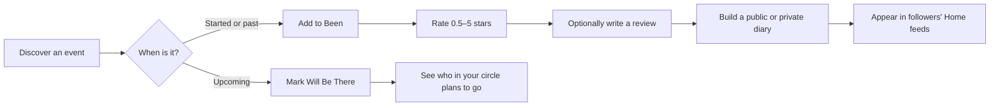
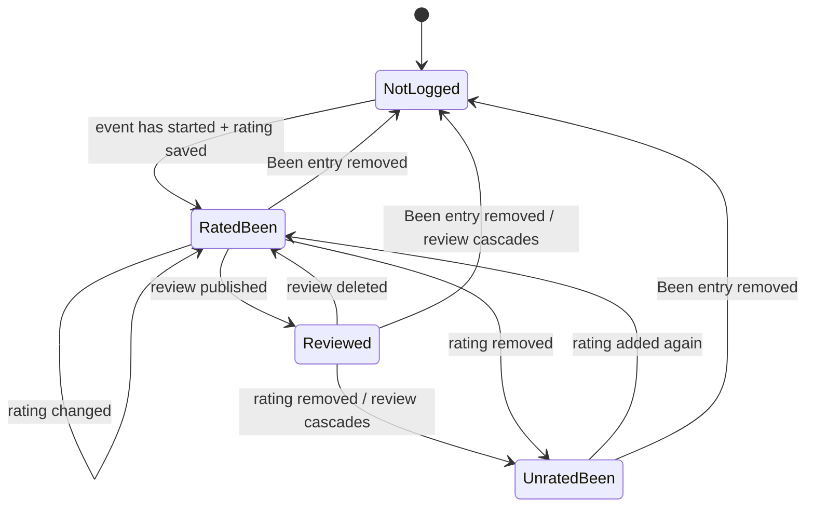
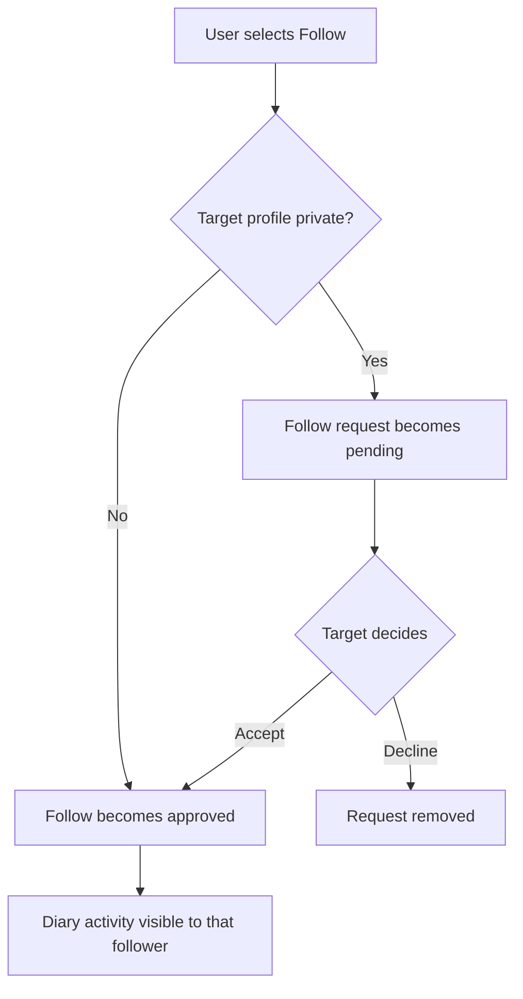

# Onda product guide

This page explains Onda from a user's point of view. It intentionally leaves implementation detail to the [ingestion](INGESTION.md), [application-data](APPLICATION_DATA.md), [API](API.md), and [database](DATABASE.md) documents.

## The product in one sentence

Onda is a social diary for live music: it helps people find events, remember the ones they attended, and discover music through people whose taste they trust.

The current catalog covers configured event listings in **New York City and Boston**. It is an engineering demo, not a launched consumer service.

[Open the live demo](https://ondaapp.io)

> **Video walkthrough:** coming soon. The finished MP4 will be linked from the root README.

## The basic journey

## Discover

Users can:

- choose a supported city and browse upcoming or past events;
- open event pages with the venue, ordered artist lineup, date, time, community rating, reviews, and attendance intent;
- open venue and artist pages and browse their related events;
- search events, artists, venues, and people;
- use canonical, shareable frontend URLs such as `/events/{slug}-{id}` while the API continues to address records by stable numeric ID.

An event's `active`, `unverified`, or `hidden` ingestion status is deliberately not exposed in the interface. `active` and `unverified` events remain visible; a `hidden` event behaves like a missing event until a later source observation restores it.

## Plan: “Will Be There”

“Will Be There” records intent for an upcoming event.

- A user can add or remove their own mark.
- Event pages show public attendees and, when signed in, attendees from the user's approved follow circle.
- The mark remains stored for historical consistency, but stops being active after the end of the event's date in the **venue's timezone**.
- The UI distinguishes “currently marked” from “was marked but has expired.”

The database does not store a guessed expiry timestamp. The application derives active state from the event date and the city's IANA timezone whenever it reads the record.

## Remember: Been, ratings, and reviews

“Been” is a user's event diary.

The user-facing rules are:

- A new Been entry requires a rating from **0.5 to 5.0 in half-star steps**.
- An event cannot be logged before its scheduled venue-local date and start time. If no start time is available, the start of the event's local date is used.
- A user has at most one Been entry per event and one review per Been entry.
- Publishing a review requires a rating; review text is 1–1,000 nonblank characters.
- Removing a rating preserves the Been entry but removes its review and that review's likes, because a published review may not exist without a rating.
- Removing the entire Been entry removes its dependent review and likes.
- Community rating averages appear only after at least three ratings, avoiding a misleading “average” based on one or two people.

## Follow people and protect private profiles

Profiles are either public or private.

- Public profiles accept follows immediately.
- Private profiles receive a pending request that can be accepted or declined.
- Private diary entries, reviews, plans, favorites, statistics, and feed activity are visible only to the owner and approved followers.
- Private contributions can still participate anonymously in aggregate rating calculations; they are not attributed publicly.
- A user can switch privacy mode. The service layer updates affected follow/request state transactionally.

The application applies these rules in database querysets before serialization. The frontend is not trusted to hide private rows after receiving them.

## Home feed

Home is assembled from current database truth. It can contain six activity types from approved follow relationships:

1. Will Be There
2. review like
3. rated Been entry
4. new follow
5. favorite event
6. favorite artist

The feed has no independently populated timeline table. Each request combines the six sources with a database `UNION ALL`, filters privacy and hidden events inside the branches, orders by a stable composite cursor, and returns the next page. This avoids write-time fan-out and stale copied activity at the current scale.

[Read how Home is assembled →](APPLICATION_DATA.md#home-is-a-projection-not-a-ledger)

## Favorites and profile statistics

- A user can choose up to three favorite events, three favorite artists, and three favorite venues.
- Favorite event and artist actions can appear in followers' Home feeds. Favorite venues are part of the profile and personalized venue navigation, not a feed activity type.
- Profiles report events in Been, reviews written, venues and cities visited, average rating given, followers, and following.
- Selecting Followers or Following opens the corresponding paginated people list; desktop uses a modal and mobile uses the full screen, with continuous loading inside the list.
- Profile owners can delete a written review directly from its Been row. The rating and Been entry remain, matching the event-detail deletion rule.
- The profile's own rating distribution is shown when it has data; event-wide community averages use the separate three-rating threshold described above.

## Notifications

Onda stores notifications for:

- review likes;
- new follows;
- private-profile follow requests;
- accepted follow requests.

Users can mark one notification or all notifications as read. Notification pages use a stable timestamp-and-ID cursor so new rows arriving between requests do not reshuffle an already traversed page.

## What is deliberately outside the current product

- It is not a ticket marketplace and does not sell or reserve admission.
- It has no public developer API; the JSON routes serve the first-party React application.
- It does not fetch event data during a user request.
- It does not claim complete worldwide event coverage.
- It is not a distributed microservice system; the shipped deployment is a modular monolith on one host.
- It has not been commercially released or broadly distributed.
- Email-verification and password-reset code paths exist, but the current live demo does not enforce email verification or have outbound transactional email configured.

## Data-source disclosure

The current event catalog is derived from a single Resident Advisor listing adapter. Onda is not affiliated with Resident Advisor, and this implementation does not establish a right to redistribute or commercialize that data. Before broader distribution or commercial use, the next step is to contact Resident Advisor and reassess the source arrangement.

The system is structured so product behavior depends on Onda's canonical event, venue, artist, and city records rather than provider-shaped responses. That reduces source coupling; it does **not** mean the current catalog has a second provider or can change sources without implementation and entity-resolution work.

[Read exactly how that boundary works →](INGESTION.md)
