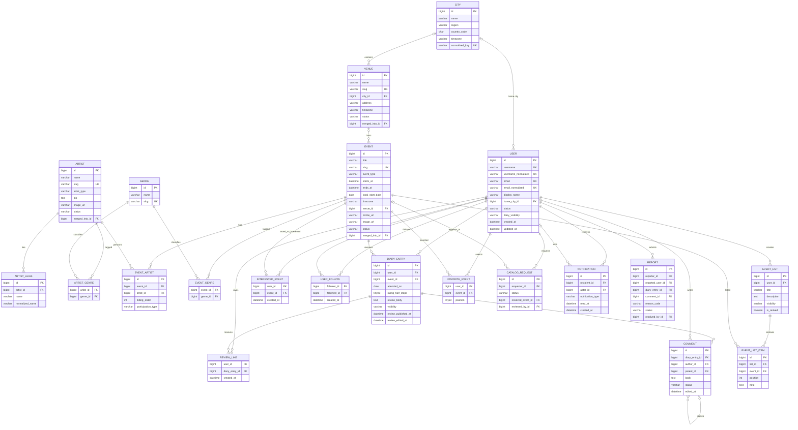

# Music Events Social Diary — ERD v2

This diagram accompanies `MUSIC_EVENTS_PLATFORM_SPEC.md`.

The central relationship is:

```text
USER -> DIARY_ENTRY -> EVENT <- EVENT_ARTIST -> ARTIST
                                  |
                                VENUE -> CITY
```

`USER` is an authenticated consumer. `ARTIST` and `VENUE` are catalog records, not accounts or businesses in the application.



## Required uniqueness constraints

- `USER(username_normalized)`
- `USER(email_normalized)`
- `ARTIST_ALIAS(artist_id, normalized_name)`
- `ARTIST_GENRE(artist_id, genre_id)`
- `EVENT_ARTIST(event_id, artist_id, participation_type)`
- `EVENT_GENRE(event_id, genre_id)`
- `DIARY_ENTRY(user_id, event_id)`
- `INTERESTED_EVENT(user_id, event_id)`
- `USER_FOLLOW(follower_id, followed_id)`
- `REVIEW_LIKE(user_id, diary_entry_id)`
- `EVENT_LIST_ITEM(list_id, event_id)`
- `EVENT_LIST_ITEM(list_id, position)`
- `FAVORITE_EVENT(user_id, event_id)`
- `FAVORITE_EVENT(user_id, position)`

## Required checks and service rules

- `DIARY_ENTRY.rating_half_steps` is null or between 1 and 10.
- A user cannot follow themselves.
- A review like requires a non-empty published review body.
- A comment requires a non-empty published review body.
- A reply and its parent must point to the same diary entry.
- A reply cannot itself have a reply.
- Favorite position is between 1 and 4.
- Exactly one report target is set.
- An event end time cannot precede its start time.
- A merged catalog record redirects to one active surviving record.
- A physical published event requires a venue; an online event does not.
- Venue and date are deliberately not unique.

Cross-row and cross-table rules belong in transactional Django services because MySQL checks cannot enforce all of them safely.
